# 📋 Memòria del Projecte FoodLogistic S.A.

## Modernització d'Infraestructura Tecnològica

### Servei d'Integració de Sistemes i Solucions Cloud

---

**Data d'entrega:** Abril 2026  
**Empresa:** TechSecure Solution  
**Client:** FoodLogistic S.A.  
**Localització:** Mataró (Polígon de les Hortes del Camí Ral)

---

## Índex

1. [Introducció](#1-introducció)
2. [Anàlisi de necessitats](#2-anàlisi-de-necessitats)
3. [Proposta de solució](#3-proposta-de-solució)
4. [Arquitectura i disseny tècnic](#4-arquitectura-i-disseny-tècnic)
5. [Part de la web](#5-part-de-la-web)
6. [Pressupost](#6-pressupost)
7. [Planificació](#7-planificació)
8. [Conclusions](#8-conclusions)

---

## 1. Introducció

### 1.1 Context del projecte

El present document recull la memòria completa del projecte de modernització tecnològica per a l'empresa **FoodLogistic S.A.**, una companyia de logística alimentària ubicada al polígon de les Hortes del Camí Ral de Mataró.

FoodLogistic S.A. opera en un sector crític on la cadena de fred i els terminis d'entrega són factors determinants per a l'èxit del negoci. Actualment, l'empresa compta amb una plantilla de **35 treballadors** distribuïts en departaments d'administració, magatzem, transport i direcció, i ha identificat la necessitat d'una renovació integral de la seva infraestructura tecnològica per mantenir-se competitiva en un mercat cada cop més digitalitzat.

### 1.2 Objectius del projecte

L'encàrrec rebut per part de FoodLogistic S.A. comprèn els següents objectius estratègics:

| Objectiu | Descripció | Prioritat |
|----------|------------|:---------:|
| **Centralització de dades** | Eliminar la compartimentació departamental i establir un sistema de fitxers unificat | Crítica |
| **Modernització del correu electrònic** | Substituir l'actual servei de hosting obsolet per una solució corporativa al núvol | Alta |
| **Presència web legal** | Crear una pàgina web corporativa que compleixi la LOPDGDD i la LSSI-CE | Alta |
| **Infraestructura d'impressió** | Implementar un sistema d'impressió fiable amb balanceig de càrrega | Mitjana |
| **Seguretat de dades** | Establir mesures de protecció i sensibilització del personal | Crítica |
| **Planificació professional** | Definir un cronograma realista amb fites clares | Mitjana |

### 1.3 Abast del projecte

Aquest projecte comprèn les següents àrees d'actuació:

- Anàlisi i disseny d'infraestructura (T01, T02)
- Servidor de fitxers i permisos NTFS (T03)
- Servidor d'impressió amb Printer Pooling (T04)
- Migració al núvol de comunicacions (T07)
- Compliment legal de la web i LOPD (T05, T06)
- Planificació i pressupost professional (T09, T10)

---

## 2. Anàlisi de necessitats

### 2.1 Situació actual de FoodLogistic S.A.

Després de realitzar una anàlisi de requeriments (T01), hem identificat les següents mancances en la infraestructura actual de l'empresa:

| Àrea | Situació actual | Problema detectat |
|------|----------------|-------------------|
| **Emmagatzematge** | Cada departament guarda fitxers de forma local | Falta de visió global, pèrdua d'informació |
| **Correu electrònic** | Servei de hosting bàsic | Obsolet, problemes de seguretat, només correu |
| **Web corporativa** | Pàgina desactualitzada | Incompliment legal, mala imatge corporativa |
| **Sistema d'impressió** | Impressores individuals sense gestió | Colls d'ampolla en hores punta |
| **Seguretat** | Sense polítiques definides | Risc de filtrat de dades |

### 2.2 Anàlisi de la competència (T01)

Per entendre el mercat on ens movem, hem analitzat tres empreses competidores a Mataró i el Maresme:

| Empresa | Ubicació | Mida | Serveis principals |
|---------|----------|------|---------------------|
| **JSM Inforedes, S.L.** | Polígon Balançó i Boter | PIME petita | Manteniment, cloud, ciberseguretat, programari de gestió |
| **ESED** | Tecnocampus Mataró | PIME especialitzada | Ciberseguretat, hacking ètic, serveis gestionats |
| **Grup Qualitat** | Múltiples seus Maresme | PIME mitjana | Consultoria TIC per logística i administracions públiques |

**Organigrama de referència (model JSM Inforedes):**

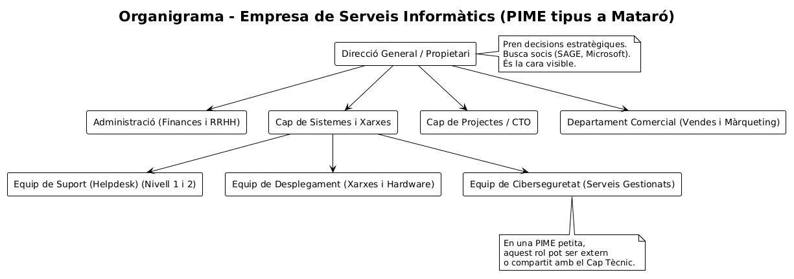

> Les funcions de ciberseguretat en PIMES petites sovint són externalitzades o compartides amb el Cap Tècnic.

### 2.3 Estratègia de diferenciació

| Pilar | Descripció | Avantatge competitiu |
|-------|------------|----------------------|
| **Proximitat** | Empresa local de Mataró | Intervencions ràpides in situ |
| **Servei 24/7** | Temps de resposta molt baixos | Crític per a logística |
| **Seguretat integral** | Ciberseguretat + servei global | Única oferta del mercat |

---

## 3. Proposta de solució

### 3.1 Infraestructura (T03) - Servidor de fitxers: https://github.com/classesSMX2n/projecte-7-Cuencaferran/tree/main/T03

#### 3.1.1 Preparació de l'entorn Active Directory

Per organitzar els recursos de FoodLogistic, hem creat una **OU anomenada `FoodLogistic_OU`** i tres grups de seguretat:

| Grup | Descripció |
|------|-------------|
| **Administracio** | Gestió de factures i albarans |
| **Transport** | Xofers i caps de flota |
| **Direccio** | Gerència i direcció |


*Vista final d'usuaris i grups a Active Directory*

#### 3.1.2 Implementació de recursos compartits

| Carpeta | Mètode de creació | UNC Path | Grups accés | Permisos |
|---------|-------------------|----------|-------------|----------|
| **Public** | Explorador arxius | `\\SERVER\Public` | Tothom | Lectura |
| **Operacions** | Server Manager (FSSM) | `\\SERVER\Operacions` | Transport | Lectura/Escriptura |
| **Direccio$** | PowerShell | `\\SERVER\Direccio$` | Direccio | Control total |


*Configuració de permisos NTFS per a la carpeta Operacions*

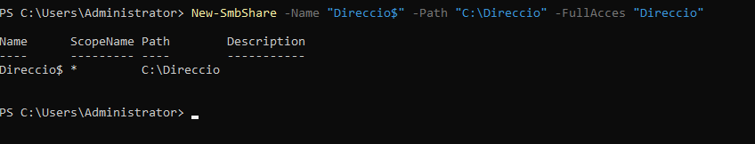

*Creació del recurs compartit Direccio$ mitjançant PowerShell*

#### 3.1.3 GPO per a unitat de xarxa (Map_Z)

Per automatitzar l'accés dels usuaris de Direcció, hem creat una GPO que mapeja la unitat **Z:** a `\\SERVER\Direccio$`.


*Drive Z: configurat apuntant a \\SERVER\Direccio$*

#### 3.1.4 Control d'emmagatzematge

| Mesura | Eina | Paràmetre |
|--------|------|-----------|
| Quota per defecte | NTFS | 500 MB per usuari |
| Quota carpeta Public | FSRM | 200 MB (Hard Quota) |
| Filtratge fitxers | FSRM | Bloqueig `.exe`, `.msi`, `.mp3`, `.mp4` |

### 3.2 Infraestructura (T04) - Servidor d'impressió amb Printer Pooling: https://github.com/classesSMX2n/projecte-7-Cuencaferran/tree/main/T04

#### 3.2.1 Context i justificació

El magatzem de FoodLogistic té un volum d'impressió crític d'albarans i fulls de transport. Si una impressora falla o es col·lapsa, els camions no poden sortir, la qual cosa trenca la cadena de fred.

**Solució:** Implementar un **Printer Pooling** que balanceja la càrrega entre dues impressores.

#### 3.2.2 Instal·lació de les impressores virtuals (PDF24)

Hem instal·lat el programari **PDF24 Creator** per simular dues impressores:

| Impressora | Nom |
|------------|-----|
| **IMP_MAGATZEM_A** | Primera impressora del pool |
| **IMP_MAGATZEM_B** | Segona impressora del pool |


*Verificació d'impressores PDF24 instal·lades al sistema*

#### 3.2.3 Configuració de carpetes de sortida

Cada impressora virtual té la seva pròpia carpeta de destí per verificar el balanceig:

| Impressora | Carpeta de sortida |
|------------|-------------------|
| IMP_MAGATZEM_A | `C:\SORTIDAA` |
| IMP_MAGATZEM_B | `C:\SORTIDAB` |

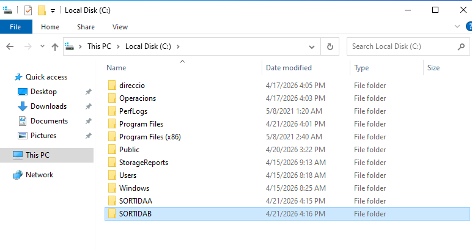

*Carpetes SORTIDAA i SORTIDAB creades al disc local*

#### 3.2.4 Instal·lació del rol Print and Document Services

Des del **Server Manager**, hem instal·lat el rol `Print and Document Services` al servidor FOODLOGISTIC.

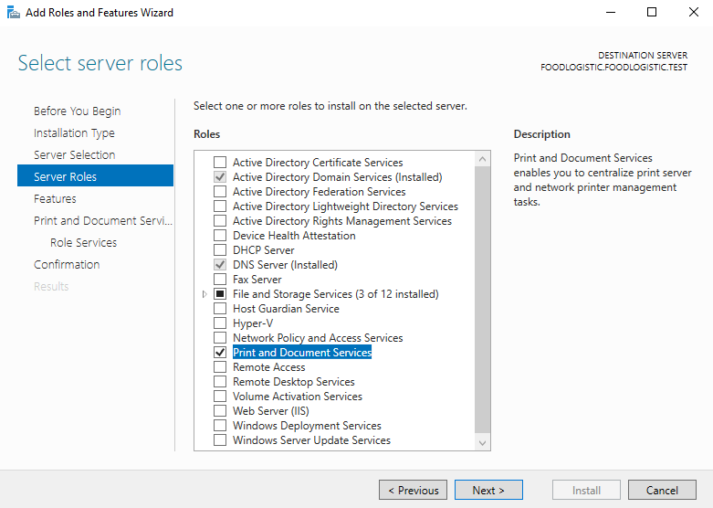

*Selecció del rol Print and Document Services a Server Manager*

#### 3.2.5 Configuració del Printer Pooling

El printer pooling s'ha configurat a la impressora **IMP_MAGATZEM_B**:

1. Accedim a Propietats de la impressora
2. Pestanya **Ports**
3. Activem **"Enable printer pooling"**
4. Seleccionem els ports de les dues impressores


*Activació del printer pooling a IMP_MAGATZEM_B*

#### 3.2.6 Nom compartit del pool

Perquè els usuaris vegin una única impressora, compartim el pool amb un nom específic:

**Nom compartit:** `IMP_MAGATZEM_POOL`

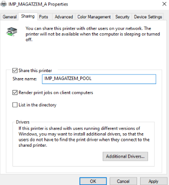

*Configuració del nom compartit IMP_MAGATZEM_POOL*

#### 3.2.7 Prova de funcionament

Hem enviat una **pàgina de prova** per verificar que ambdues impressores funcionen correctament.

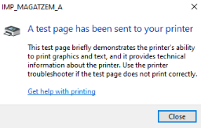

*Confirmació que la pàgina de prova s'ha enviat correctament*

**Verificació dels resultats:**

| Carpeta | Contingut | Estat |
|---------|-----------|:-----:|
| `C:\SORTIDAA` | PDF de la pàgina de prova | ✅ |
| `C:\SORTIDAB` | PDF de la pàgina de prova | ✅ |

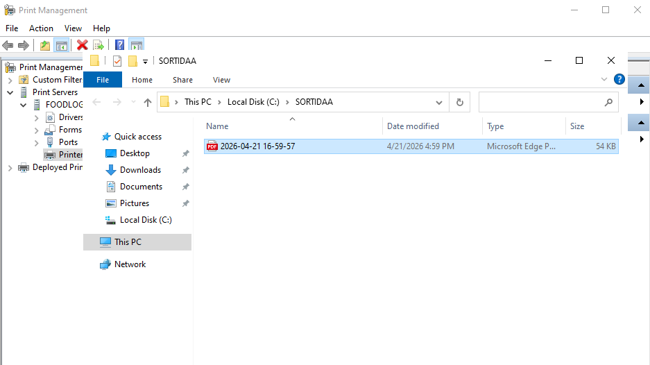

*Carpeta SORTIDAA amb el PDF generat*

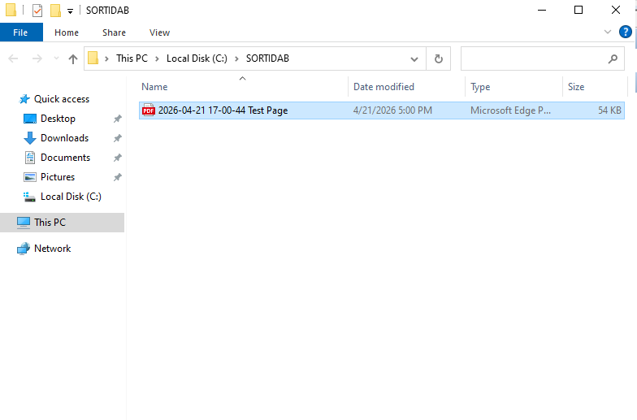

*Carpeta SORTIDAB amb el PDF generat*

### 3.3 Serveis al núvol (T07)

#### Comparativa de proveïdors

| Característica | Google Workspace | Microsoft 365 | Zoho Workplace |
|----------------|------------------|---------------|----------------|
| **Cost mensual/usuari** | 11,50 € | 10,80 € | 6,00 € |
| **Cost anual (35 usuaris)** | 4.830 € | 4.536 € | 2.520 € |
| **MFA (doble factor)** | ✅ | ✅ | ✅ |
| **ATP antimalware** | ❌ | ✅ | ❌ |
| **Teams integrat** | ❌ | ✅ | ❌ |

#### Opció escollida: Microsoft 365 Business Standard

**Justificació:**
- 🔒 **Seguretat màxima:** MFA, ATP, DLP de sèrie
- 📋 **Compliment GDPR:** Essencial per a dades de clients
- 🤝 **Col·laboració:** Teams integrat amb xat i videotrucades
- ☁️ **Migració senzilla:** Eina gratuïta de Microsoft

### 3.4 Seguretat i LOPD (T05, T06)

#### 3.4.1 Compliment legal de la web

| Element | Estat | Descripció |
|---------|:-----:|-------------|
| Avís Legal | ✅ | Dades registrals, propietat intel·lectual, jurisdicció |
| Política Privacitat | ✅ | Base legal, drets ARSULIPO |
| Política Cookies | ✅ | Tipus, finalitat, configuració |
| Banner Cookies | ✅ | Acceptar / Rebutjar / Configurar |
| Checkbox obligatòria | ✅ | Consentiment exprés (desmarcada per defecte) |

#### 3.4.2 Vídeos formatius

| Vídeo | Públic | Durada | Contingut principal |
|-------|--------|--------|---------------------|
| **Compliment legal dia a dia** | General | 5-6 min | Windows+L, contrasenyes, USB, impressió segura |
| **Protecció dades RRHH** | Administració | 5-6 min | CV, responsables, drets ARSULIPO |

📹 **Accés als vídeos:** [Carpeta Google Drive](https://drive.google.com/drive/folders/1cWc2G8u0lY84zUCgNNBInLxyD0DP6up5)

### 3.5 Presència web (T02, T06, T08)

#### Web corporativa final

🔗 **URL:** [https://classessmx2n.github.io/web-projecte7-PerezAran/index.html](https://classessmx2n.github.io/web-projecte7-PerezAran/index.html)

**Procés de selecció:** Fusió de les propostes individuals d'Aran (disseny net i responsive) i Ferran (navegació intuïtiva i paleta de colors coherent).

---

## 4. Arquitectura i disseny tècnic

### 4.1 Diagrama d'infraestructura

```
┌─────────────────────────────────────────────────────────────────────────────┐
│                          FOODLOGISTIC S.A.                                  │
│                                                                             │
│  ┌───────────────────────────────────────────────────────────────────────┐ │
│  │                         ACTIVE DIRECTORY                              │ │
│  │                         foodlogistic.test                             │ │
│  │                                                                       │ │
│  │   ┌─────────────┐   ┌─────────────┐   ┌─────────────┐               │ │
│  │   │  Servidor   │   │  Servidor   │   │  Servidor   │               │ │
│  │   │  Fitxers    │   │  Impressió  │   │  Web        │               │ │
│  │   │   (T03)     │   │   (T04)     │   │  (T06)      │               │ │
│  │   └──────┬──────┘   └──────┬──────┘   └──────┬──────┘               │ │
│  │          └─────────────────┼─────────────────┘                       │ │
│  │                            │                                         │ │
│  │                     ┌──────┴──────┐                                  │ │
│  │                     │   Switch    │                                  │ │
│  │                     └──────┬──────┘                                  │ │
│  │         ┌──────────────────┼──────────────────┐                     │ │
│  │    ┌────┴────┐        ┌────┴────┐        ┌────┴────┐               │ │
│  │    │Magatzem │        │Oficines │        │Transport│               │ │
│  │    │ (15)    │        │ (12)    │        │ (8)     │               │ │
│  │    └─────────┘        └─────────┘        └─────────┘               │ │
│  └───────────────────────────────────────────────────────────────────────┘ │
│                                                                             │
│  ┌───────────────────────────────────────────────────────────────────────┐ │
│  │                    SERVIDOR D'IMPRESSIÓ (T04)                         │ │
│  │                                                                       │ │
│  │   ┌─────────────────┐         ┌─────────────────┐                    │ │
│  │   │ IMP_MAGATZEM_A  │         │ IMP_MAGATZEM_B  │                    │ │
│  │   │  (C:\SORTIDAA)  │◄───────►│  (C:\SORTIDAB)  │                    │ │
│  │   └────────┬────────┘         └────────┬────────┘                    │ │
│  │            │                           │                             │ │
│  │            └───────────┬───────────────┘                             │ │
│  │                        ▼                                             │ │
│  │            ┌─────────────────────┐                                   │ │
│  │            │  IMP_MAGATZEM_POOL  │  ← Printer Pooling                │ │
│  │            │  (GPO desplegada)   │                                   │ │
│  │            └─────────────────────┘                                   │ │
│  └───────────────────────────────────────────────────────────────────────┘ │
│                                                                             │
│  ┌───────────────────────────────────────────────────────────────────────┐ │
│  │                         SERVEIS AL NÚVOL                               │ │
│  │            Microsoft 365 (Outlook, Teams, OneDrive)                   │ │
│  └───────────────────────────────────────────────────────────────────────┘ │
└─────────────────────────────────────────────────────────────────────────────┘
```

### 4.2 Taula resum de serveis implementats

| Servei | Tecnologia | Ubicació | Estat |
|--------|------------|----------|:-----:|
| Active Directory | Windows Server 2022 | Local | ✅ |
| Servidor fitxers | SMB/NTFS + FSRM | Local | ✅ |
| Servidor impressió | Print Services + Printer Pooling + GPO | Local | ✅ |
| Correu electrònic | Microsoft 365 | Núvol | ✅ |
| Web corporativa | GitHub Pages | Núvol | ✅ |

### 4.3 Resum de permisos efectius (T03)

| Carpeta | Grup | Permís efectiu |
|---------|------|----------------|
| **Public** | Tothom | **Lectura** |
| **Operacions** | Transport | **Lectura/Escriptura** |
| **Direccio$** | Direccio | **Control total** |

### 4.4 Resum printer pooling (T04)

| Element | Valor |
|---------|-------|
| **Impressores** | IMP_MAGATZEM_A i IMP_MAGATZEM_B |
| **Mode** | Printer Pooling (balanceig de càrrega) |
| **Nom compartit** | IMP_MAGATZEM_POOL |
| **Desplegament** | GPO per màquina |
| **Tolerància falles** | ✅ (si una falla, l'altra processa tots els treballs) |

---

## 5. Part de la web

### 5.1 Estructura de la web

```
web-corporativa/
├── index.html              # Pàgina principal
├── avis-legal.html         # Avís Legal (LSSI-CE)
├── politica-privacitat.html # Política Privacitat (RGPD)
├── politica-cookies.html   # Política de Cookies
└── css/style.css           # Estils
```

### 5.2 Contingut de les pàgines legals

| Pàgina | Contingut principal |
|--------|---------------------|
| **Avís Legal** | Denominació social, NIF, dades registrals, jurisdicció |
| **Política Privacitat** | Responsable tractament, base legal, drets ARSULIPO |
| **Política Cookies** | Tipus de cookies, tauler de configuració |

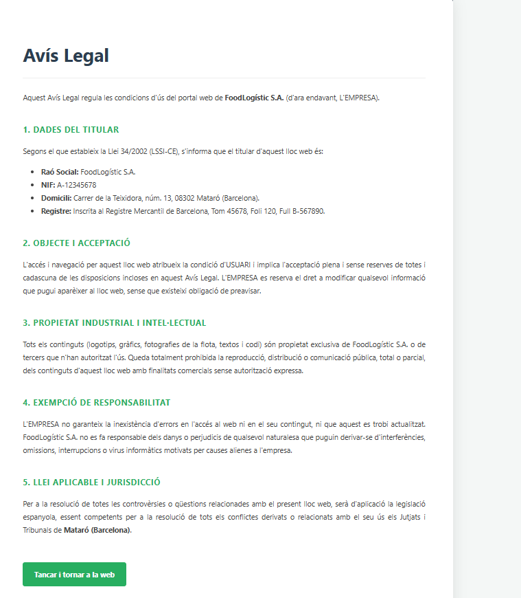

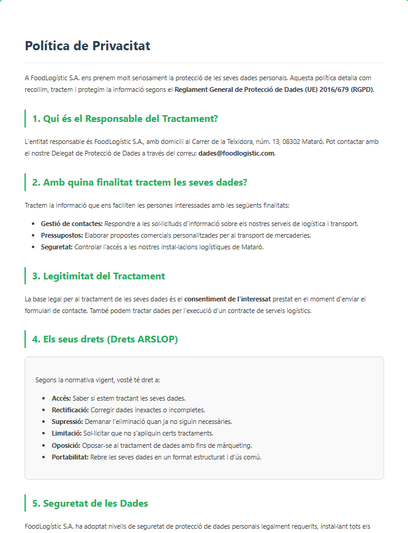

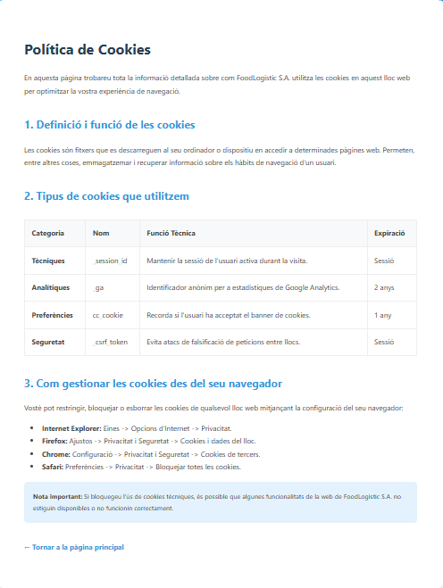

### 5.3 Formulari de contacte

**Camps obligatoris:** Nom, Correu electrònic, Missatge

**Checkboxes:**
- ☐ Accepto la Política de Privacitat *(obligatòria, desmarcada)*
- ☐ Accepto rebre comunicacions comercials *(opcional, desmarcada)*

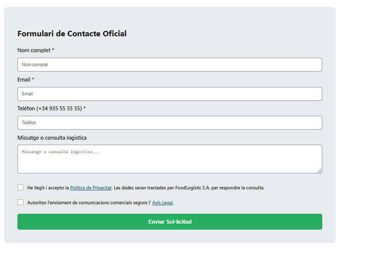

---

## 6. Pressupost

### 6.1 Costos d'implantació (pagament únic)

| Concepte | Hores | Preu/hora (€) | Cost (€) |
|----------|:-----:|:-------------:|---------:|
| Configuració servidors alta disponibilitat | 25 | 40 | 1.000 € |
| Migració al núvol | 20 | 40 | 800 € |
| Desenvolupament pàgina web | 30 | 40 | 1.200 € |
| Vídeo formatiu LOPD | 10 | 40 | 400 € |
| Llicències inicials | - | - | 300 € |
| Maquinari / Infraestructura | - | - | 1.000 € |
| **Total Implantació** | | | **4.700 €** |

### 6.2 Costos recurrents (mensuals)

| Concepte | Unitats | Preu unitari (€) | Cost mensual (€) |
|----------|:-------:|:---------------:|-----------------:|
| Subscripció SaaS (Microsoft 365) | 10 usuaris | 12 | 120 € |
| Hosting web | 1 | 20 | 20 € |
| Domini | 1 | 1 | 1 € |
| Suport i manteniment | fix | fix | 200 € |
| **Total mensual** | | | **341 €** |

---

## 7. Planificació

### 7.1 Diagrama de Gantt

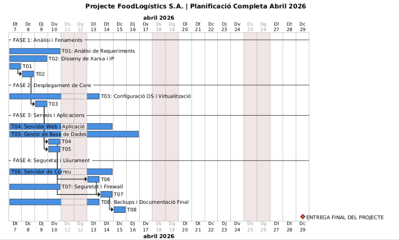

*Figura 2: Diagrama de Gantt del projecte FoodLogistic S.A.*

**Codi PlantUML utilitzat:**

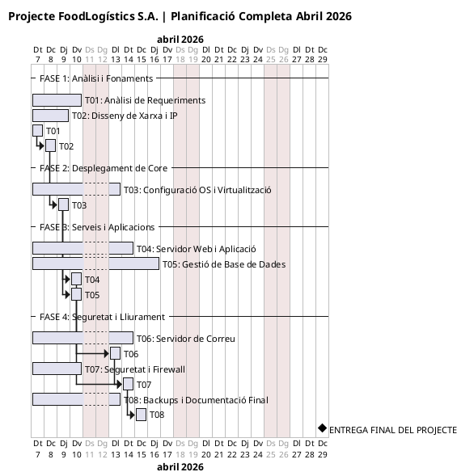

### 7.2 Matriu de responsabilitats (RACI)

| Tasca | Membre A (Líder) | Membre B (Sistemes) | Membre C (Xarxes) |
|-------|:----------------:|:-------------------:|:-----------------:|
| T01: Anàlisi | **A** | **R** | **R** |
| T02: Disseny xarxa | I | C | **A** |
| T03: Virtualització | C | **A** | **R** |
| T04: Web i App | **R** | **A** | I |
| T05: BBDD | **R** | **A** | I |
| T06: Correu | A | **R** | C |
| T07: Seguretat | C | I | **R** |
| T08: Backups | **R** | A | I |

> **R** = Responsable | **A** = Accountable (valida) | **C** = Consultat | **I** = Informat

### 7.3 Camí crític

**Tasca més crítica:** 🔴 **T03 (Configuració OS i Active Directory)** - Fonament de tota la infraestructura

**Principal coll d'ampolla:** 🟡 **T07 (Seguretat)** - Depèn de T04 i T06

### 7.4 Taula de riscos

| Risc | Probabilitat | Impacte | Mesura de contingència |
|------|:------------:|:-------:|------------------------|
| Incompatibilitat maquinari | Baixa | Crític | Validació prèvia |
| Retard llicències | Mitjana | Mitjà | Comandes amb 2 setmanes |
| Error en permisos NTFS | Mitjana | Alt | Proves amb usuaris de prova |

---

## 8. Conclusions

### 8.1 Resum d'assoliments

| Objectiu | Estat | Evidència |
|----------|:-----:|-----------|
| Centralitzar dades | ✅ | Servidor fitxers amb 3 carpetes compartides |
| Gestionar usuaris i grups | ✅ | Active Directory amb OU i grups |
| Automatitzar unitats de xarxa | ✅ | GPO Map_Z per al grup Direccio |
| Modernitzar comunicacions | ✅ | Proposta Microsoft 365 |
| Complir normativa web | ✅ | Web compliant |
| Implementar impressió fiable | ✅ | Printer pooling |
| Garantir seguretat | ✅ | Vídeos formatius |

### 8.2 Valoració final

Aquest projecte suposa per a **FoodLogistic S.A.**:

| Àrea | Millora esperada |
|------|------------------|
| **Productivitat** | +30% en gestió documental |
| **Seguretat** | Eliminació de riscos de filtrat de dades |
| **Imatge corporativa** | Compliment legal i web professional |
| **Comunicació interna** | Eines col·laboratives al núvol |

---

**Document elaborat per:** TechSecure Solution  
**Data:** Abril 2026  
**Versió:** 1.0

