# 🖨️ T04: Servidor d'Impressió - Configuració de Printer Pooling i GPO

Aquesta guia documenta pas a pas la configuració d'un servidor d'impressió a Windows Server amb Printer Pooling per balancejar la càrrega entre dues impressores. L'objectiu és instal·lar el rol d'impressió, configurar el pool de dues impressores PDF24 i desplegar-les automàticament mitjançant GPO.

---

## 📸 Captura 1 – Descàrrega de PDF24 Creator

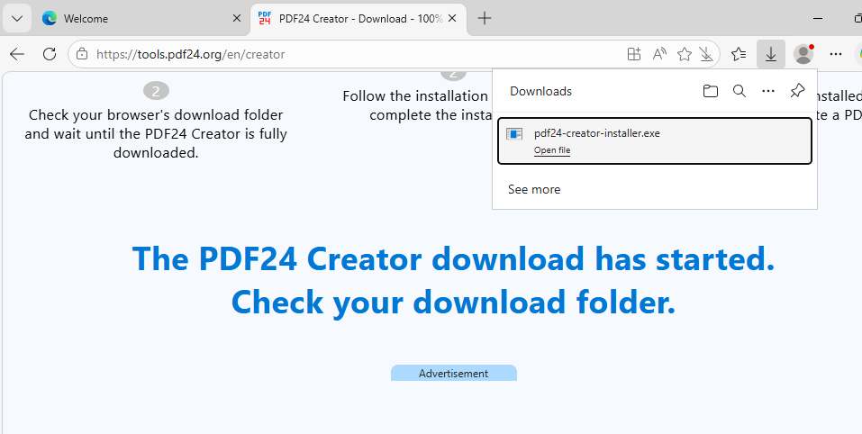

**Què s'hi veu?**  
Pàgina de descàrrega del PDF24 Creator des del navegador.

**Què s'està fent?**  
S'inicia la descàrrega de l'instal·lador del programari per crear impressores virtuals.

---

## 📸 Captura 2 – Acceptació de la llicència

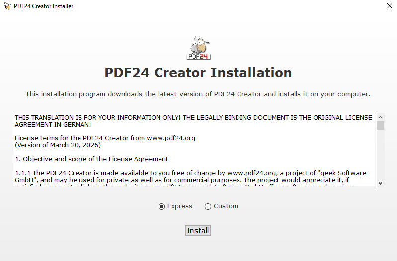

**Què s'hi veu?**  
Termes de la llicència del PDF24 Creator.

**Què s'està fent?**  
S'accepten els termes de la llicència (programari gratuït per a ús comercial i privat).

---

## 📸 Captura 3 – Instal·lació del PDF24

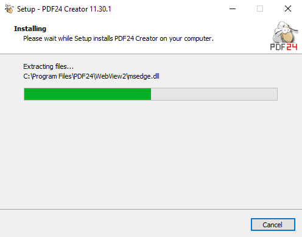

**Què s'hi veu?**  
Procés d'extracció d'arxius durant la instal·lació.

**Què s'està fent?**  
S'està instal·lant el PDF24 Creator al sistema.

---

## 📸 Captura 4 – Verificació d'impressores (Opcional - no enviada)

Com podeu veure ja tenim al PDF24 a l'escriptori posat.

---

## 📸 Captura 5 – Impressores disponibles

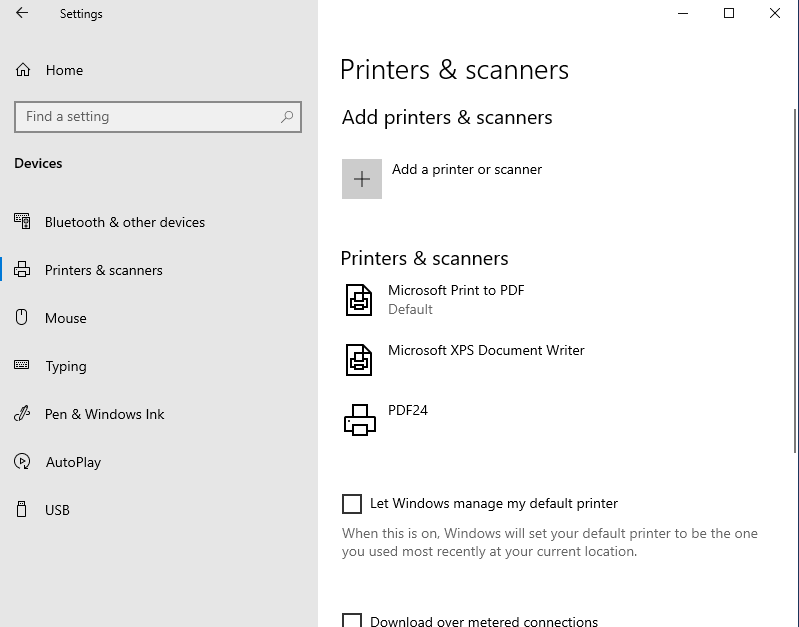

**Què s'hi veu?**  
Llista d'impressores a "Printers & scanners" de Windows.

**Què s'està fent?**  
Es verifica que les impressores PDF24 estan instal·lades correctament.

---

## 📸 Captura 6 – PDF24 Launcher

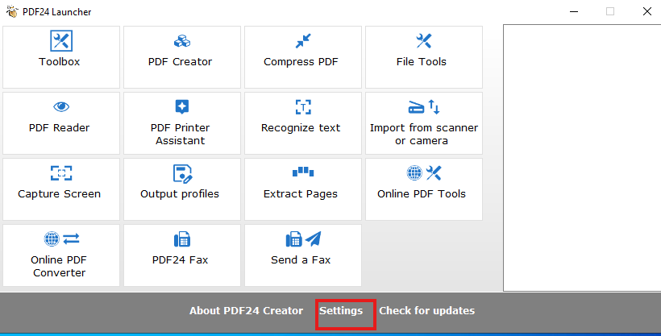

**Què s'hi veu?**  
Interfície principal del PDF24 Launcher amb totes les eines disponibles.

**Què s'està fent?**  
S'obre el llançador per accedir a la configuració de les impressores.

---

## 📸 Captura 7 – Configuració d'IMP_MAGATZEM_A

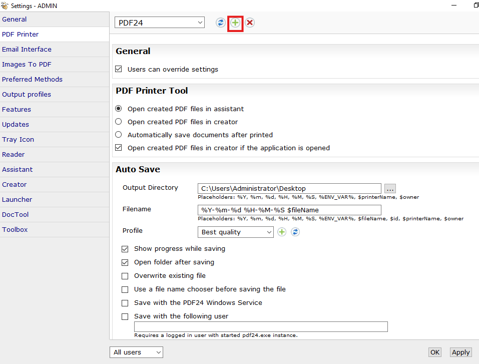

**Què s'hi veu?**  
Finestra de configuració de la impressora amb opcions generals.

**Què s'està fent?**  
Es comença a configurar la impressora IMP_MAGATZEM_A.

---

## 📸 Captura 8 – Confirmació d'IMP_MAGATZEM_A

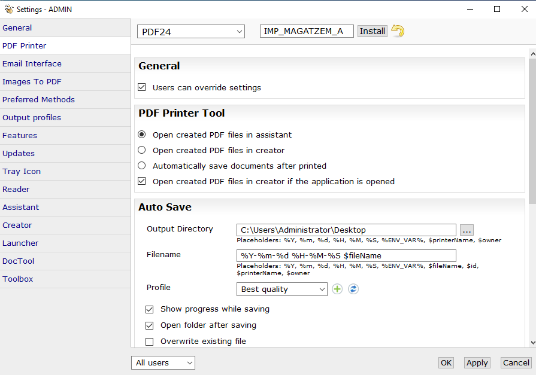

**Què s'hi veu?**  
La impressora IMP_MAGATZEM_A apareix a la llista de configuració.

**Què s'està fent?**  
Es confirma que la impressora A està creada i disponible.

---

## 📸 Captura 9 – Configuració d'IMP_MAGATZEM_B

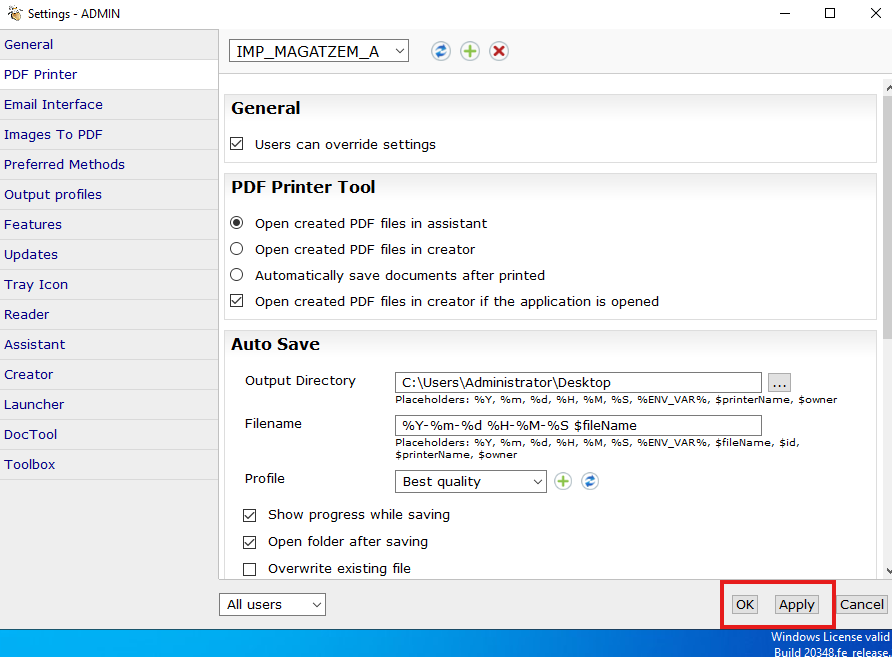

**Què s'hi veu?**  
Finestra de configuració de la impressora B.

**Què s'està fent?**  
Es configura la segona impressora IMP_MAGATZEM_B.

---

## 📸 Captura 10 – Ambdues impressores creades

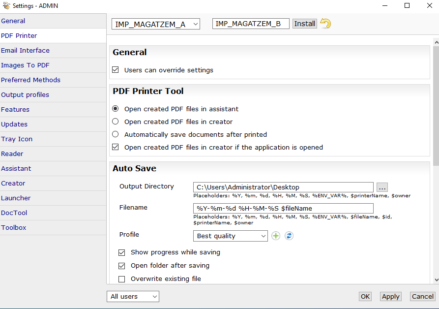

**Què s'hi veu?**  
Llista de configuració amb IMP_MAGATZEM_A i IMP_MAGATZEM_B.

**Què s'està fent?**  
Es verifica que les dues impressores estan creades correctament.

---

## 📸 Captura 11 – Printers & scanners

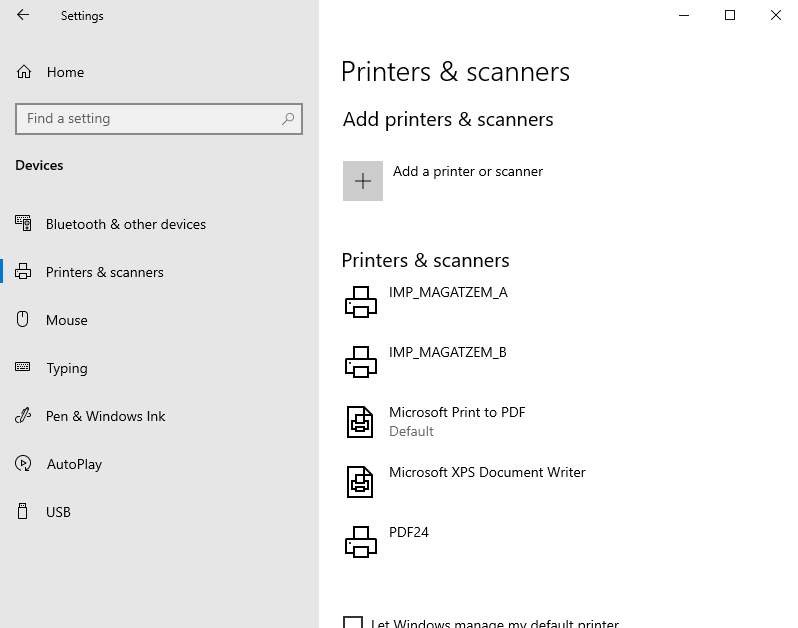

**Què s'hi veu?**  
Llista d'impressores des de Configuració de Windows.

**Què s'està fent?**  
Es confirmen les dues impressores des del panell de control.

---

## 📸 Captura 12 – Gestionar IMP_MAGATZEM_A

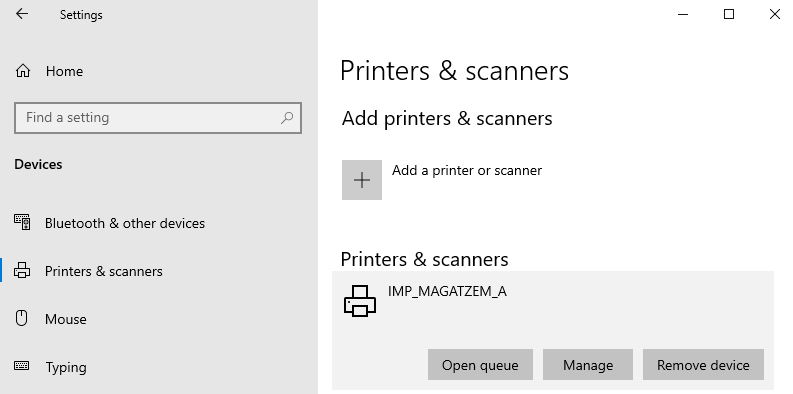

**Què s'hi veu?**  
Menú contextual de la impressora A amb opcions.

**Què s'està fent?**  
S'accedeix a les opcions de gestió d'IMP_MAGATZEM_A.

---

## 📸 Captura 13 – Gestionar IMP_MAGATZEM_B

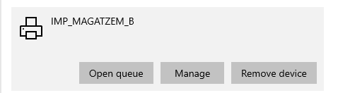

**Què s'hi veu?**  
Menú contextual de la impressora B amb opcions.

**Què s'està fent?**  
S'accedeix a les opcions de gestió d'IMP_MAGATZEM_B.

---

## 📸 Captura 14 – Creació de carpetes de sortida

**Què s'hi veu?**  
Explorador de Windows amb les carpetes SORTIDAA i SORTIDAB.

**Què s'està fent?**  
Es creen les carpetes on es guardaran els PDFs generats per cada impressora.

---

## 📸 Captura 15 – Directori de sortida d'IMP_MAGATZEM_A

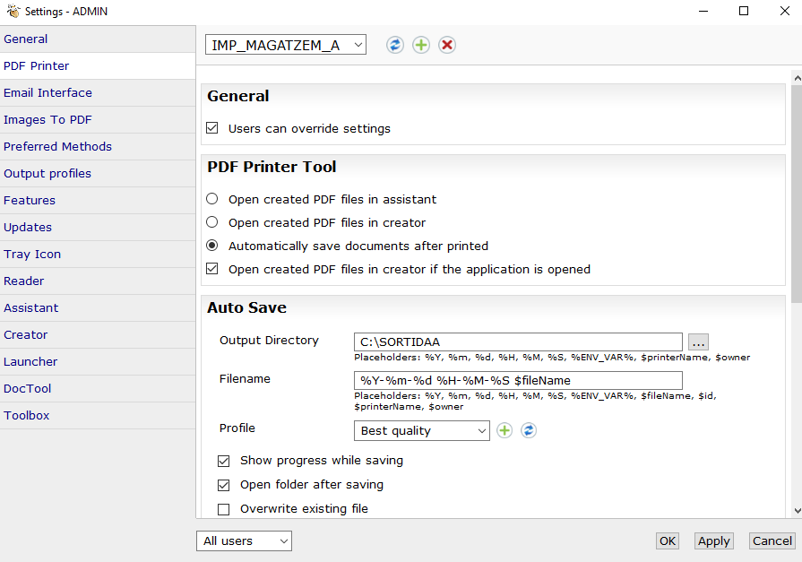

**Directori:** `C:\SORTIDAA`

**Què s'està fent?**  
Es configura la carpeta SORTIDAA com a directori de sortida per la impressora A.

---

## 📸 Captura 16 – Directori de sortida d'IMP_MAGATZEM_B

**Directori:** `C:\SORTIDAB`

**Què s'està fent?**  
Es configura la carpeta SORTIDAB com a directori de sortida per la impressora B.

---

## 📸 Captura 17 – Server Manager

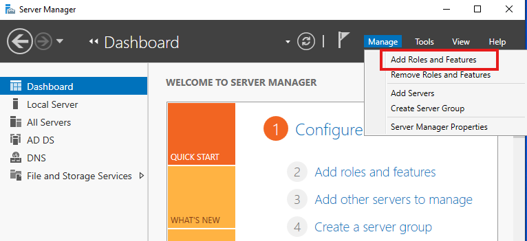

**Què s'hi veu?**  
Dashboard del Server Manager amb les opcions de configuració.

**Què s'està fent?**  
S'obre l'eina principal d'administració del servidor.

---

## 📸 Captura 18 – Selecció del tipus d'instal·lació

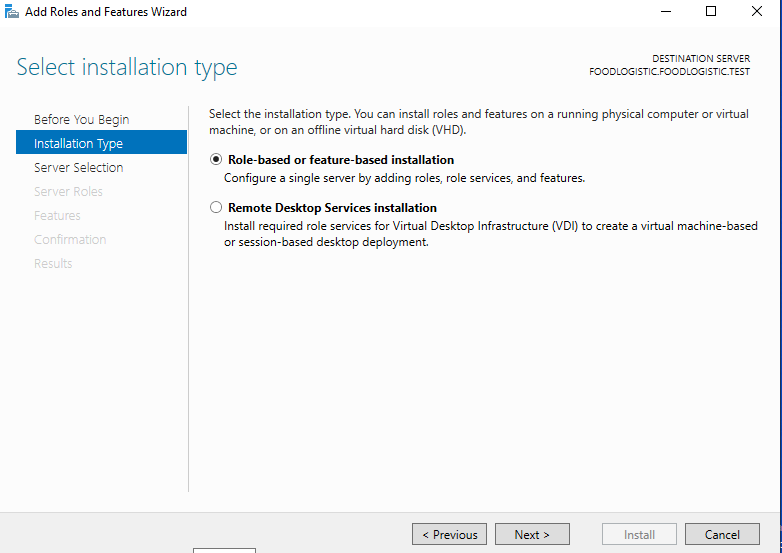

**Opció seleccionada:** `Role-based or feature-based installation`

**Què s'està fent?**  
Es selecciona el tipus d'instal·lació per afegir rols al servidor.

---

## 📸 Captura 19 – Selecció del servidor destí

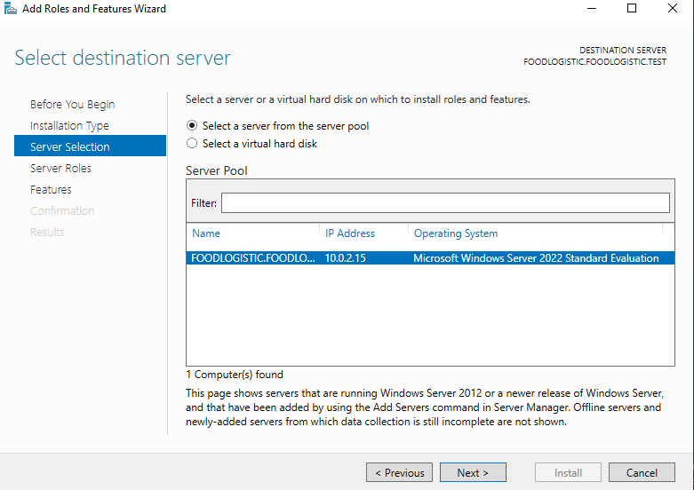

**Servidor:** `FOODLOGISTIC.FOODLOGISTIC.TEST`

**Què s'està fent?**  
Es tria el servidor on s'instal·larà el rol d'impressió.

---

## 📸 Captura 20 – Selecció del rol Print and Document Services

**Rol seleccionat:** `Print and Document Services`

**Què s'està fent?**  
Es marca el rol de serveis d'impressió i documents.

---

## 📸 Captura 21 – Confirmació d'instal·lació

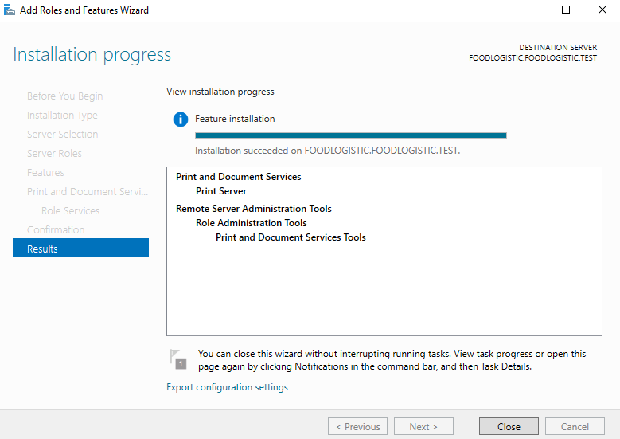

**Estat:** `Installation succeeded`

**Què s'està fent?**  
Es verifica que el rol s'ha instal·lat correctament.

---

## 📸 Captura 22 – Eines disponibles

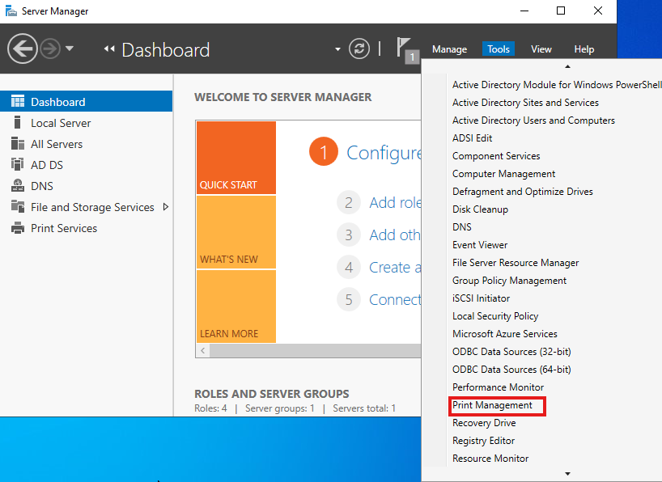

**Què s'hi veu?**  
Llista d'eines del Server Manager amb `Print Management` destacat.

**Què s'està fent?**  
S'identifica l'eina Print Management per gestionar les impressores.

---

## 📸 Captura 23 – Print Management

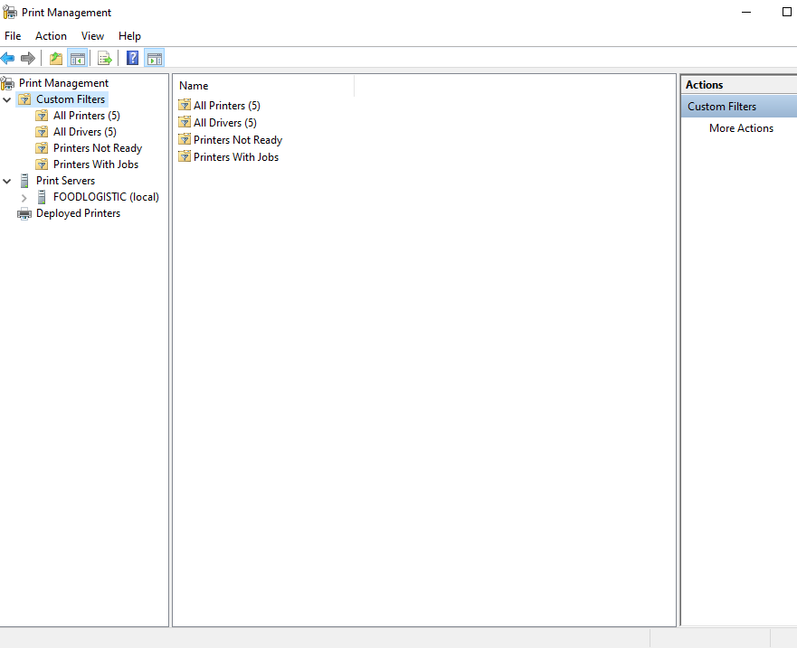

**Què s'hi veu?**  
Consola principal de Print Management.

**Què s'està fent?**  
S'obre la consola de gestió d'impressió.

---

## 📸 Captura 24 – Estructura de Print Management

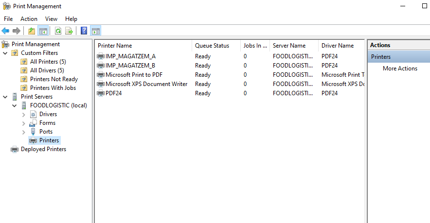

**Què s'hi veu?**  
Vista jeràrquica de Print Management.

**Què s'està fent?**  
S'explora l'estructura de la consola.

---

## 📸 Captura 25 – Gestió de cues

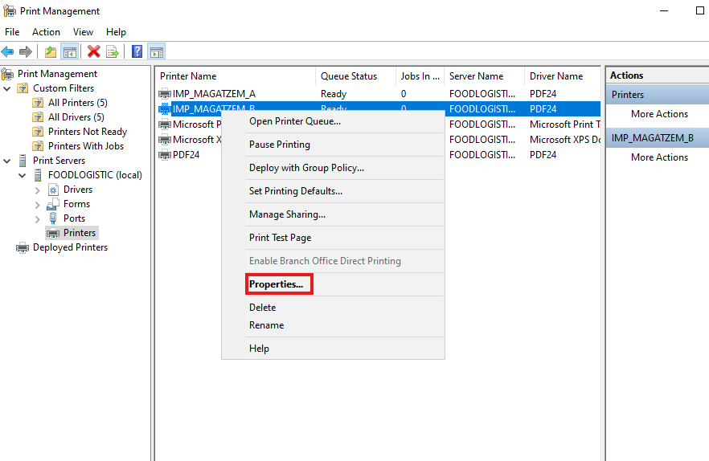

**Què s'hi veu?**  
Opcions de gestió de cues d'impressió.

**Què s'està fent?**  
S'accedeix a la secció de cues.

---

## 📸 Captura 26 – Propietats de compartició d'IMP_MAGATZEM_B

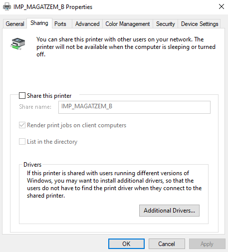

**Què s'hi veu?**  
Pestanya "Sharing" de les propietats d'IMP_MAGATZEM_B.

**Què s'està fent?**  
Es revisa la configuració de compartició de la impressora B.

---

## 📸 Captura 27 – Vista general de Print Management

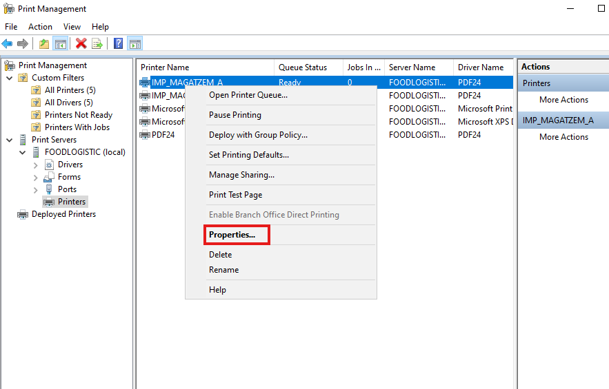

**Què s'hi veu?**  
Estructura completa de la consola Print Management.

**Què s'està fent?**  
Es visualitzen tots els components de gestió d'impressió.

---

## 📸 Captura 28 – Ports d'IMP_MAGATZEM_A

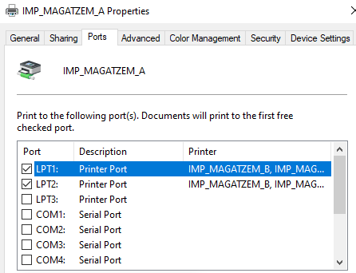

**Què s'hi veu?**  
Pestanya "Ports" amb els ports disponibles.

**Què s'està fent?**  
Es revisa la configuració de ports abans d'activar el pooling.

---

## 📸 Captura 29 – Activació de Printer Pooling

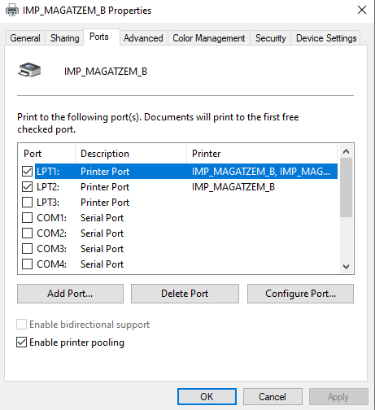

**Opció marcada:** `Enable printer pooling`

**Què s'està fent?**  
S'activa el printer pooling a IMP_MAGATZEM_B.

---

## 📸 Captura 30 – Configuració del nom compartit del pool

**Share name:** `IMP_MAGATZEM_POOL`

**Què s'està fent?**  
Es configura el nom amb què es compartirà el pool d'impressores.

---

## 📸 Captura 31 – Propietats generals

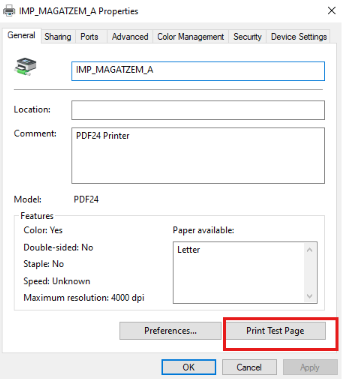

**Què s'hi veu?**  
Pestanya "General" amb informació de la impressora.

**Què s'està fent?**  
Es revisa la informació general d'IMP_MAGATZEM_A.

---

## 📸 Captura 32 – Pàgina de prova

**Missatge:** `A test page has been sent to your printer`

**Què s'està fent?**  
S'envia una pàgina de prova per verificar el funcionament.

---

## 📸 Captura 33 – Verificació SORTIDAA

**Què s'hi veu?**  
Carpeta SORTIDAA amb el fitxer de la pàgina de prova.

**Què s'està fent?**  
Es comprova que la impressora A ha generat el PDF correctament.

---

## 📸 Captura 34 – Verificació SORTIDAB

**Què s'hi veu?**  
Carpeta SORTIDAB amb el fitxer de la pàgina de prova.

**Què s'està fent?**  
Es comprova que la impressora B ha generat el PDF correctament.

---

## 📸 Captura 35 – Accés a Print Management

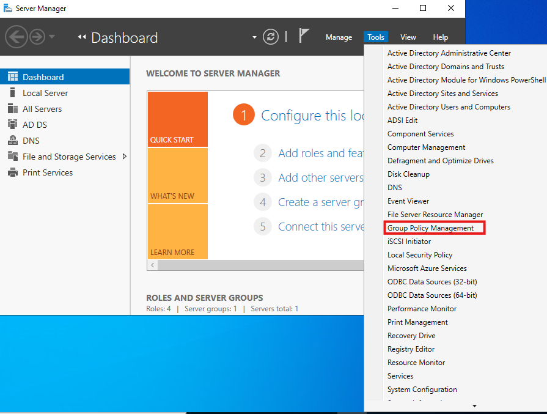

**Què s'hi veu?**  
Eines del Server Manager amb Print Management seleccionat.

**Què s'està fent?**  
S'accedeix a Print Management des del menú d'eines.

---

## 📸 Captura 36 – Creació de la GPO

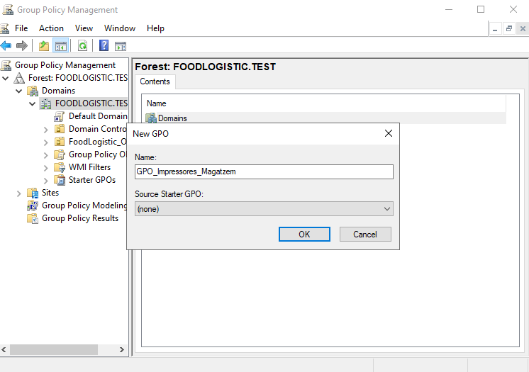

**Nom de la GPO:** `GPO_Impressores_Magatzem`

**Què s'està fent?**  
Es crea una nova Group Policy Object per desplegar les impressores.

---

## 📸 Captura 37 – Deploy with Group Policy

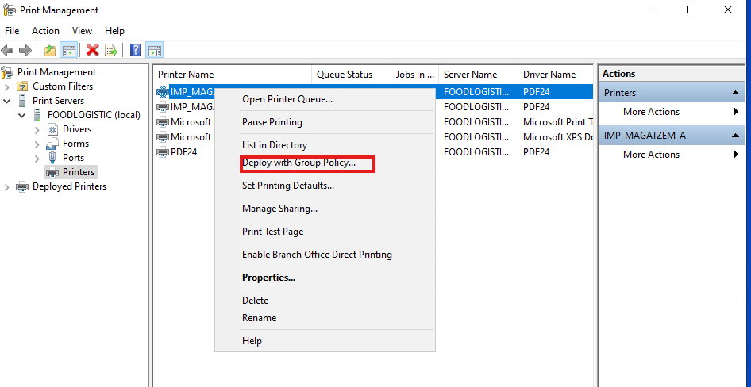

**Opció seleccionada:** `Deploy with Group Policy...`

**Què s'està fent?**  
S'inicia l'assistent per desplegar la impressora mitjançant GPO.

---

## 📸 Captura 38 – Configuració del desplegament

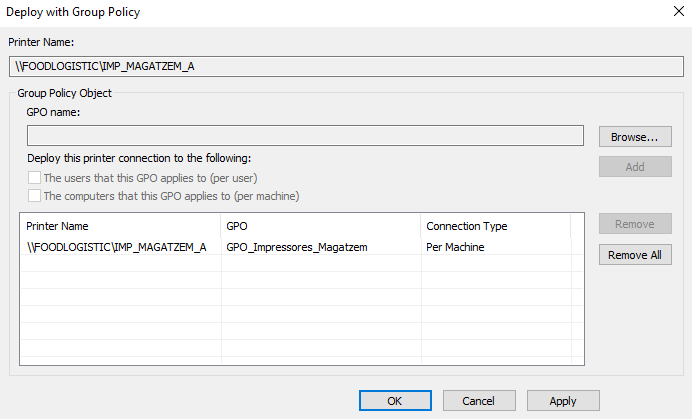

**GPO name:** `GPO_Impressores_Magatzem`  
**Opció:** `Per machine`

**Què s'està fent?**  
Es configura el desplegament de la impressora per ordinador.

---

## 📸 Captura 39 – Verificació de la GPO

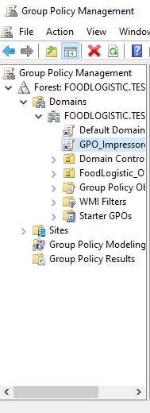

**Què s'hi veu?**  
Group Policy Management amb la GPO creada.

**Què s'està fent?**  
Es verifica que la GPO s'ha creat correctament.

---

## 📸 Captura 40 – gpupdate /force

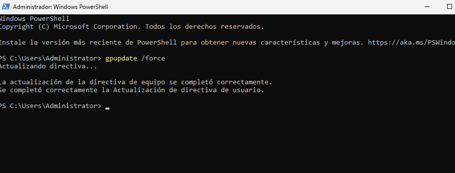

**Comanda:** `gpupdate /force`

**Què s'està fent?**  
S'executa l'actualització forçada de les polítiques al client.

---

## 📸 Captura 41 – Impressora desplegada al client

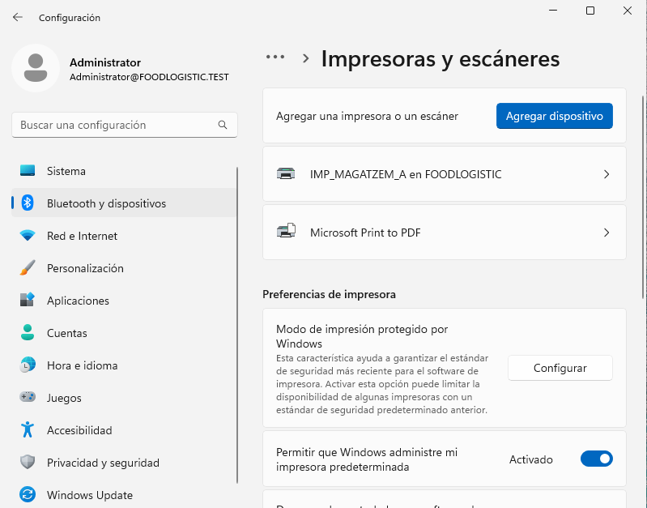

**Què s'hi veu?**  
`IMP_MAGATZEM_A en FOODLOGISTIC` apareix a l'equip client.

**Què s'està fent?**  
Es comprova que la impressora s'ha desplegat automàticament.

---

## 📸 Captura 42 – Documents de prova

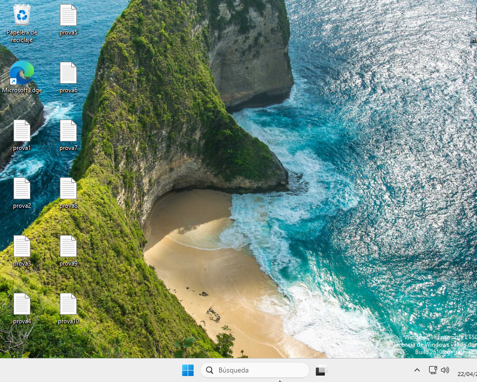

**Què s'hi veu?**  
10 documents enviats a la impressora.

**Què s'està fent?**  
Es realitza la prova de càrrega enviant múltiples treballs d'impressió.

---

## 📸 Captura 43 – Resultats SORTIDAA

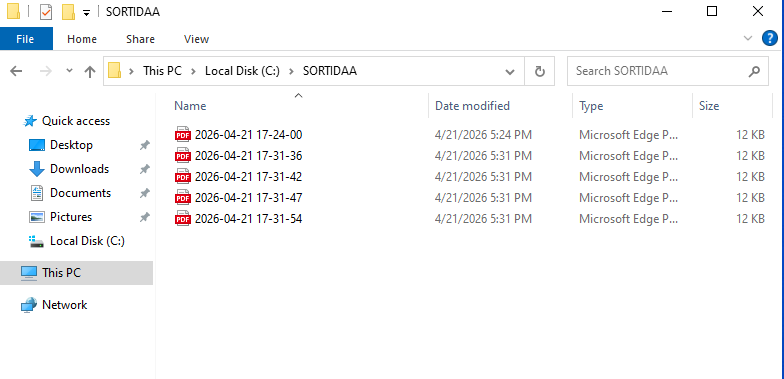

**Què s'hi veu?**  
PDFs generats a la carpeta SORTIDAA.

**Què s'està fent?**  
Es comprova quins treballs ha processat la impressora A.

---

## 📸 Captura 44 – Resultats SORTIDAB

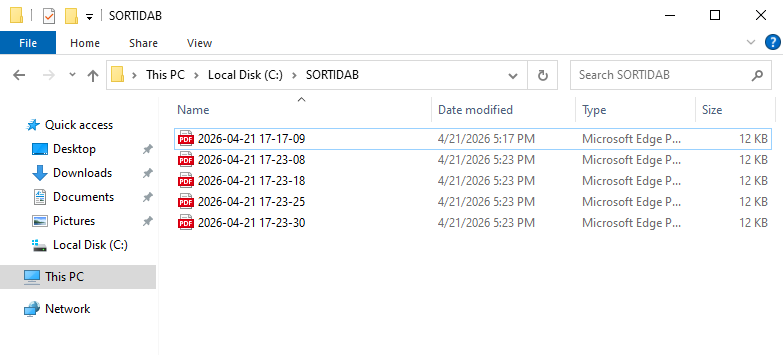

**Què s'hi veu?**  
PDFs generats a la carpeta SORTIDAB.

**Què s'està fent?**  
Es comprova quins treballs ha processat la impressora B.

---

## 📸 Captura 45 – Restriccions horàries

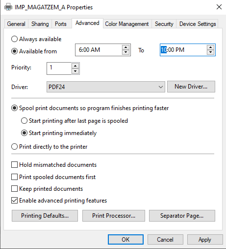

**Configuració:** `Available from 6:00 AM To 10:00 PM`

**Què s'està fent?**  
Es configura l'horari laboral (06:00 a 22:00) per a la impressora.

---

## ✅ Resum final

| Fase | Objectiu | Estat |
|------|----------|:-----:|
| Fase 1 | Instal·lació PDF24 i creació d'impressores | ✅ |
| Fase 2 | Instal·lació del rol Print and Document Services | ✅ |
| Fase 3 | Configuració del Printer Pooling | ✅ |
| Fase 4 | Desplegament automàtic amb GPO | ✅ |
| Fase 5 | Proves de càrrega i restriccions horàries | ✅ |

---

> 🏆 **Implementació finalitzada amb èxit** - Sistema preparat per a producció