# 📧 Pràctica d'iRedMail: Instal·lació i configuració d'un servidor de correu

Aquesta guia documenta pas a pas la instal·lació i configuració d'un servidor de correu electrònic complet utilitzant **iRedMail** en un sistema Ubuntu. L'objectiu és desplegar un servidor de correu funcional amb domini propi, usuaris, webmail i panell d'administració.

---

## 📸 Captura 1 – Configuració de xarxa del servidor

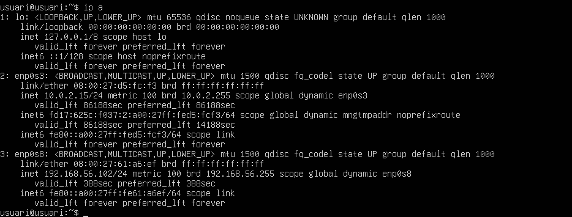

**Què s'hi veu?**  
Les interfícies de xarxa del servidor amb les seves adreces IP.

**Què s'està fent?**  
Es verifica la configuració de xarxa per conèixer les IPs des de les quals s'accedirà al servidor (`10.0.2.15` i `192.168.56.102`).

---

## 📸 Captura 2 – Fitxer hosts (versió inicial)

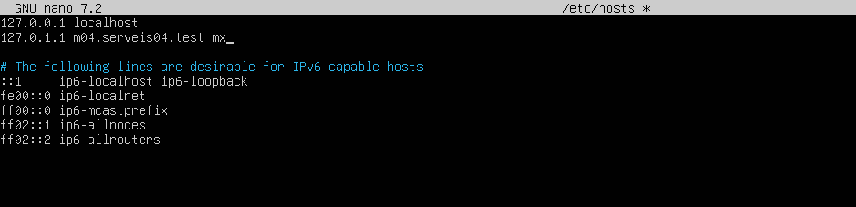

**Què s'hi veu?**  
El contingut inicial del fitxer `/etc/hosts` amb una línia per `m04.serveis04.test mx_`.

**Què s'està fent?**  
Es comença a editar la resolució local de noms per definir el nom del servidor.

---

## 📸 Captura 3 – Verificació del nom del servidor

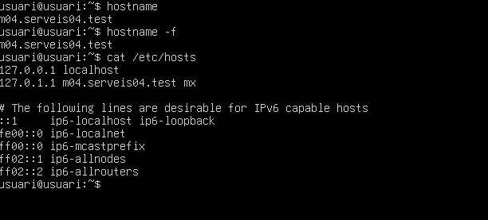

**Què s'hi veu?**  
La sortida dels comandaments `hostname`, `hostname -f` i el contingut corregit de `/etc/hosts`.

**Què s'està fent?**  
Es comprova que el nom del servidor (`m04.serveis04.test`) estigui ben configurat abans d'instal·lar iRedMail.

---

## 📸 Captura 4 – Descàrrega d'iRedMail

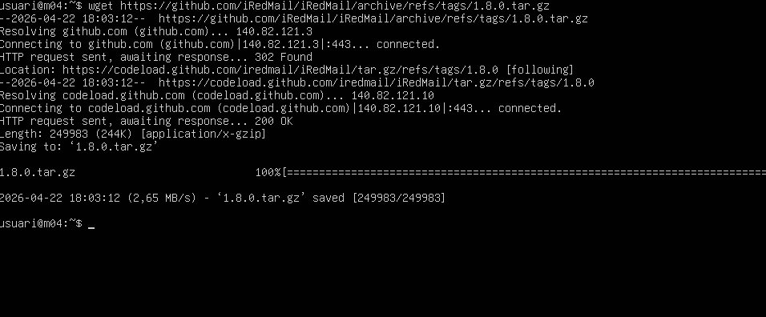

**Què s'hi veu?**  
La comanda `wget` descarregant el fitxer `1.8.0.tar.gz` des de GitHub.

**Què s'està fent?**  
Es descarrega la versió 1.8.0 d'iRedMail per instal·lar el servidor de correu.

---

## 📸 Captura 5 – Descompressió del fitxer

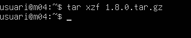

**Què s'hi veu?**  
La comanda `tar xzf` descomprimint el fitxer baixat.

**Què s'està fent?**  
S'extrau el contingut del fitxer comprimit per poder executar l'instal·lador.

---

## 📸 Captura 6 – Accés a la carpeta d'iRedMail

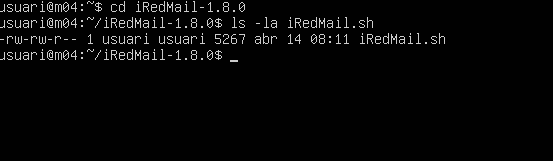

**Què s'hi veu?**  
L'usuari accedeix a la carpeta `iRedMail-1.8.0` i llista el contingut amb `ls -la`.

**Què s'està fent?**  
Es verifica que el script `iRedMail.sh` existeix i té permisos d'execució.

---

## 📸 Captura 7 – Execució de l'instal·lador

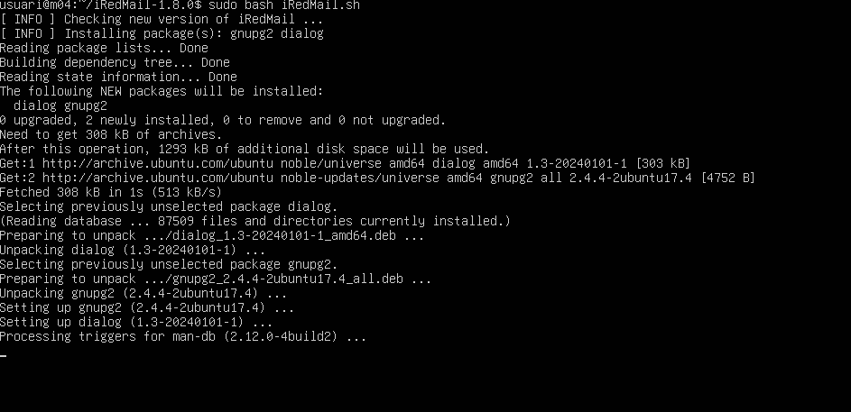

**Què s'hi veu?**  
L'instal·lador s'executa amb `sudo bash iRedMail.sh` i comença a instal·lar paquets (`dialog`, `gnupg2`).

**Què s'està fent?**  
S'inicia el procés d'instal·lació d'iRedMail, que automàticament instal·la les dependències necessàries.

---

## 📸 Captura 8 – Baixada de components addicionals

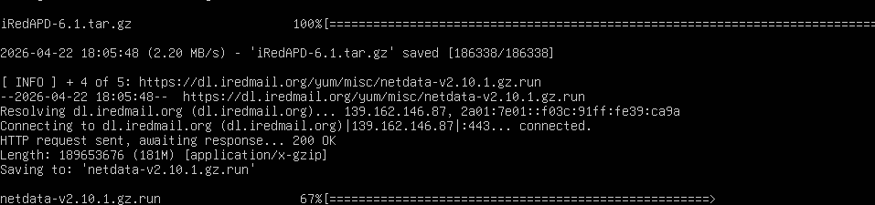

**Què s'hi veu?**  
L'instal·lador baixa components com `netdata-v2.10.1.gz.run` durant el procés.

**Què s'està fent?**  
L'instal·lador descarrega automàticament tots els paquets addicionals que configuraran el servidor de correu complet.

---

## 📸 Captura 9 – Pantalla de benvinguda

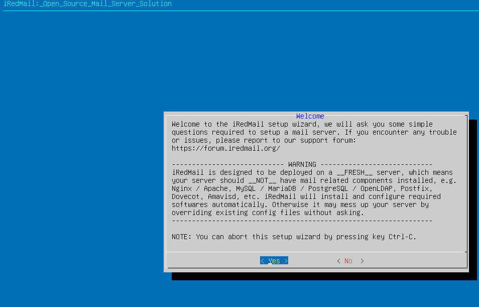

**Què s'hi veu?**  
El missatge de benvinguda d'iRedMail advertint que s'ha d'instal·lar en un servidor net.

**Què s'està fent?**  
Es llegeix l'advertència que no hi hagi serveis de correu previs al sistema abans de continuar.

---

## 📸 Captura 10 – Ruta d'emmagatzematge dels correus

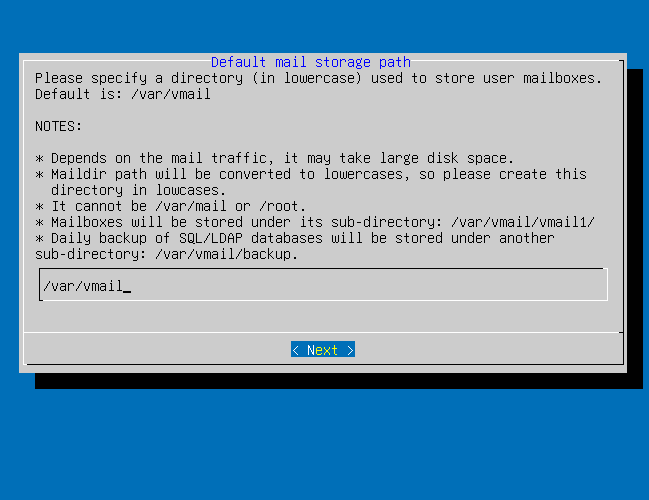

**Què s'hi veu?**  
La pantalla per especificar el directori d'emmagatzematge dels correus: `/var/vmail`.

**Què s'està fent?**  
Es defineix on es guardaran les bústies de correu dels usuaris.

---

## 📸 Captura 11 – Selecció del servidor web

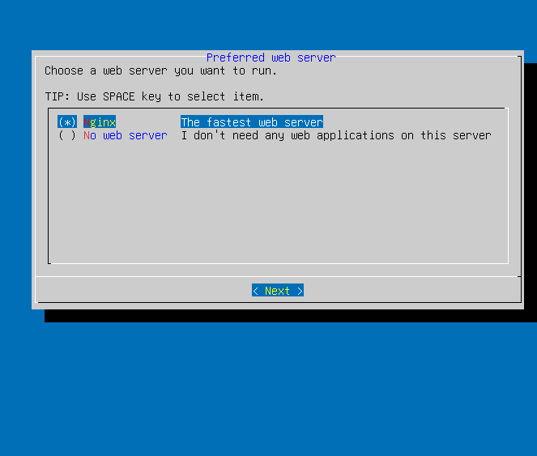

**Què s'hi veu?**  
Les opcions de servidor web: `nginx` o cap servidor.

**Què s'està fent?**  
Es selecciona `nginx` com a servidor web per servir els panells d'administració i webmail.

---

## 📸 Captura 12 – Selecció del backend de base de dades

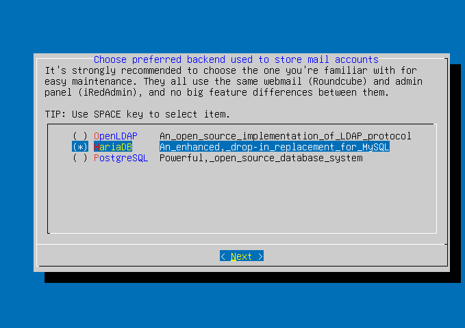

**Què s'hi veu?**  
Les opcions de backend: `OpenLDAP`, `MariaDB` o `PostgreSQL`.

**Què s'està fent?**  
Es selecciona `MariaDB` per emmagatzemar els comptes de correu i la configuració.

---

## 📸 Captura 13 – Contrasenya de l'administrador de MySQL

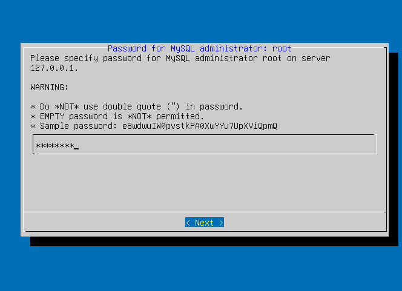

**Què s'hi veu?**  
La pantalla per introduir la contrasenya de l'usuari `root` de MariaDB.

**Què s'està fent?**  
S'estableix una contrasenya segura per a l'administrador de la base de dades.

---

## 📸 Captura 14 – Primer domini de correu

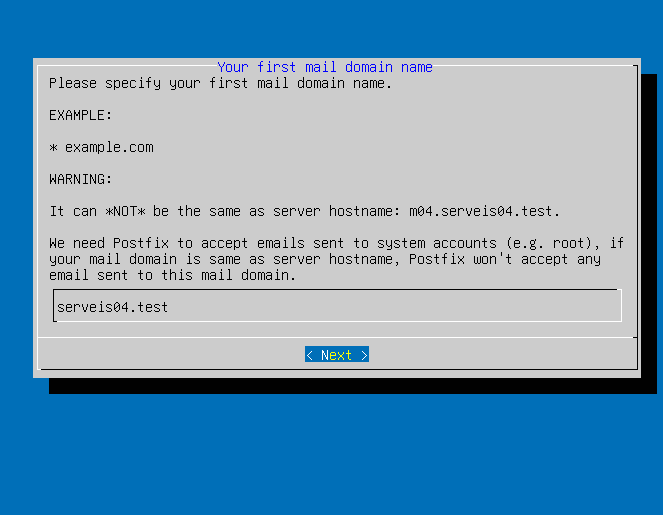

**Què s'hi veu?**  
La pantalla per especificar el primer domini de correu: `serveis04.test`.

**Què s'està fent?**  
Es defineix el domini principal del servidor de correu (no pot coincidir amb el hostname).

---

## 📸 Captura 15 – Contrasenya de l'administrador del domini

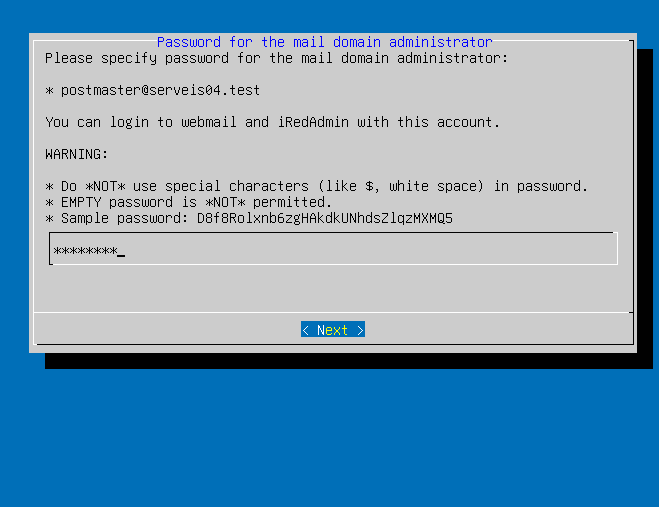

**Què s'hi veu?**  
La pantalla per posar la contrasenya de `postmaster@serveis04.test`.

**Què s'està fent?**  
S'estableix la contrasenya per a l'usuari administrador del domini de correu.

---

## 📸 Captura 16 – Selecció de components opcionals

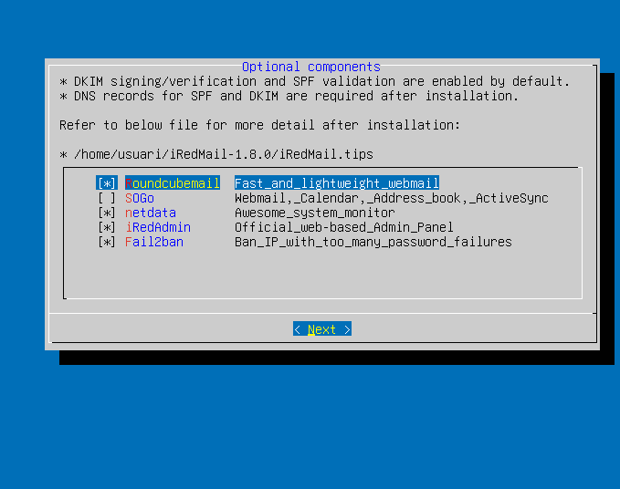

**Què s'hi veu?**  
La llista de components opcionals: Roundcube, SOGo, netdata, iRedAdmin, Fail2ban.

**Què s'està fent?**  
Es seleccionen `Roundcube` (webmail), `netdata` (monitoratge), `iRedAdmin` (panell d'admin) i `Fail2ban` (seguretat).

---

## 📸 Captura 17 – Finalització de la instal·lació

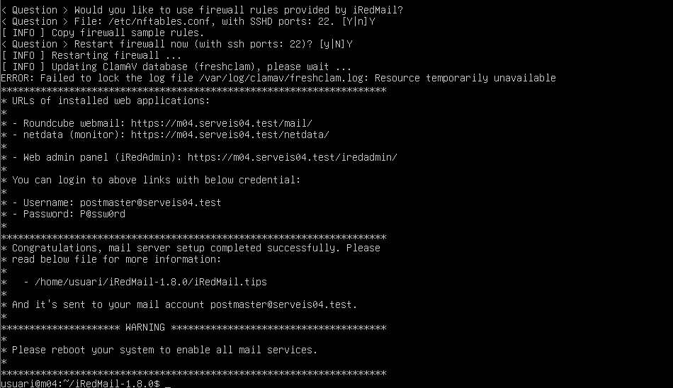

**Què s'hi veu?**  
El resum final amb els enllaços d'accés i les credencials: `postmaster@serveis04.test` / `P@ssword`.

**Què s'està fent?**  
Es completa la instal·lació i es mostren les dades d'accés als panells web.

---

## 📸 Captura 18 – Reinici del sistema

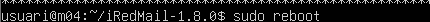

**Què s'hi veu?**  
La comanda `sudo reboot` executant-se.

**Què s'està fent?**  
Es reinicia el servidor per activar tots els serveis de correu instal·lats.

---

## 📸 Captura 19 – Accés al panell iRedAdmin

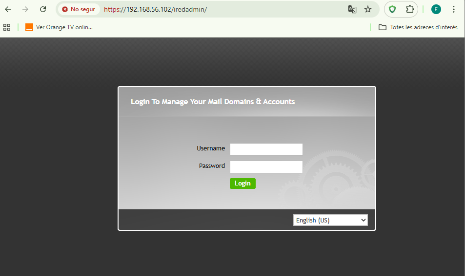

**Què s'hi veu?**  
La pantalla d'inici de sessió d'iRedAdmin a `https://192.168.56.102/iredadmin/`.

**Què s'està fent?**  
S'accedeix al panell d'administració web per gestionar dominis i usuaris.

---

## 📸 Captura 20 – Dashboard d'iRedAdmin

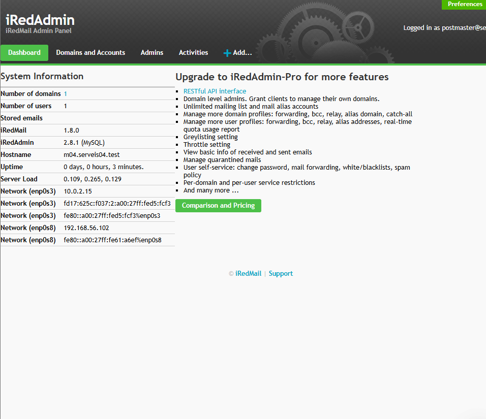

**Què s'hi veu?**  
El panell principal amb informació del sistema: 1 domini, 1 usuari, hostname, etc.

**Què s'està fent?**  
Es visualitza l'estat general del servidor de correu després de la instal·lació.

---

## 📸 Captura 21 – Creació d'un nou domini

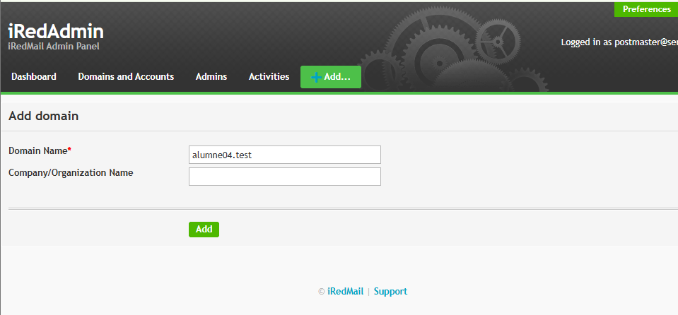

**Què s'hi veu?**  
El formulari per crear un nou domini: `alumne04.test`.

**Què s'està fent?**  
S'afegeix un segon domini de correu al servidor.

---

## 📸 Captura 22 – Perfil del domini creat

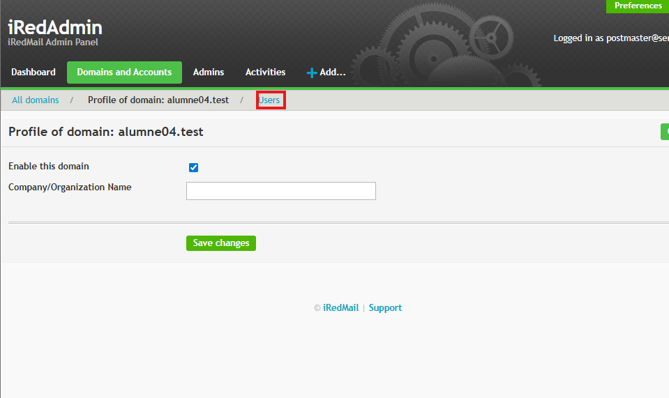

**Què s'hi veu?**  
La pàgina de perfil del domini `alumne04.test` recentment creat.

**Què s'està fent?**  
Es confirma que el domini s'ha creat correctament i es poden afegir usuaris.

---

## 📸 Captura 23 – Creació d'un usuari

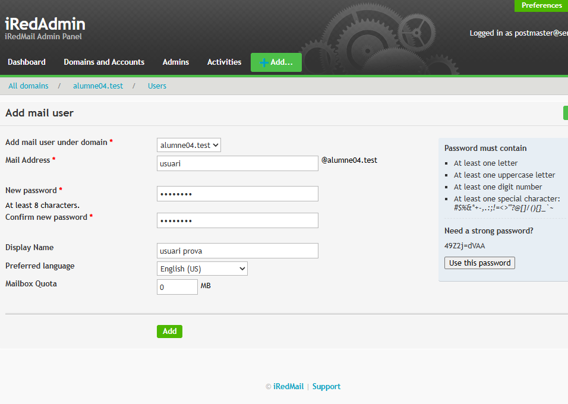

**Què s'hi veu?**  
El formulari per crear l'usuari `usuari@alumne04.test` amb contrasenya `49Z2j=dVAA`.

**Què s'està fent?**  
Es crea un nou compte de correu dins del domini `alumne04.test`.

---

## 📸 Captura 24 – Pantalla d'inici de Roundcube

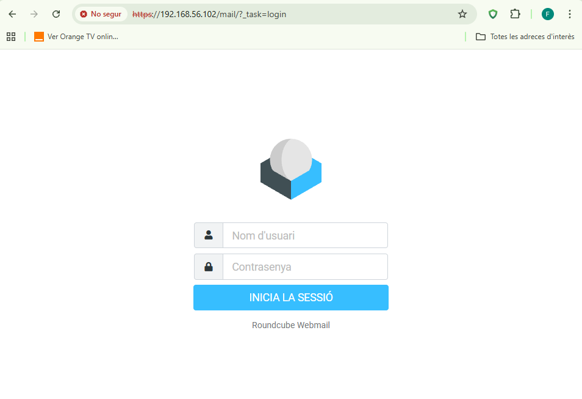

**Què s'hi veu?**  
La pàgina de login del webmail Roundcube a `https://192.168.56.102/mail/`.

**Què s'està fent?**  
S'accedeix al webmail per enviar i rebre correus.

---

## 📸 Captura 25 – Safata d'entrada de Roundcube

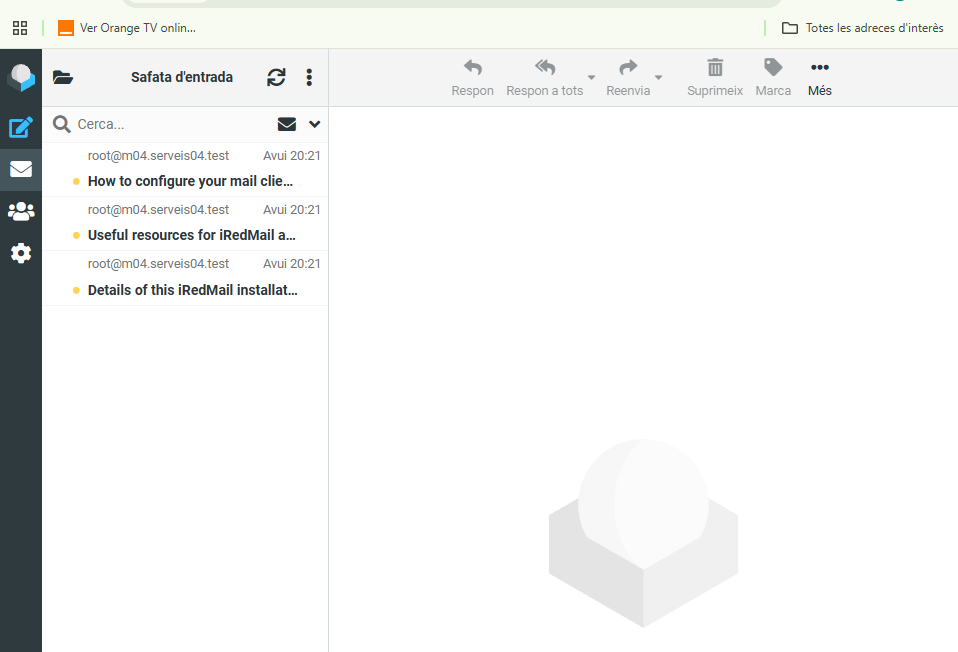

**Què s'hi veu?**  
La safata d'entrada amb correus rebuts del sistema.

**Què s'està fent?**  
Es verifica que el webmail funciona i rep missatges correctament.

---

## 📸 Captura 26 – Redacció d'un correu de prova

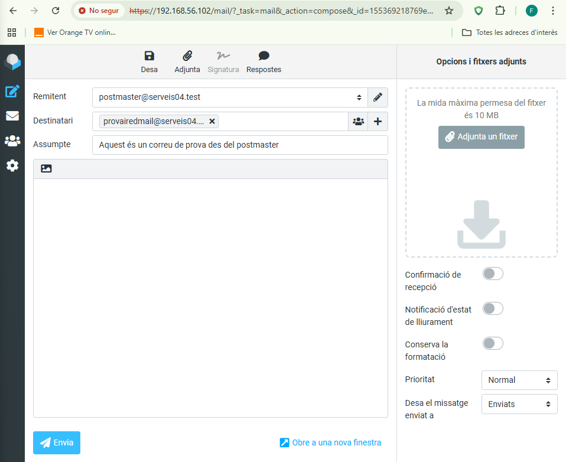

**Què s'hi veu?**  
El formulari de redacció d'un correu des de `postmaster@serveis04.test` a `provairedmail@serveis04.test`.

**Què s'està fent?**  
S'envia un correu de prova entre dos usuaris del mateix domini.

---

## 📸 Captura 27 – Inici de sessió del destinatari

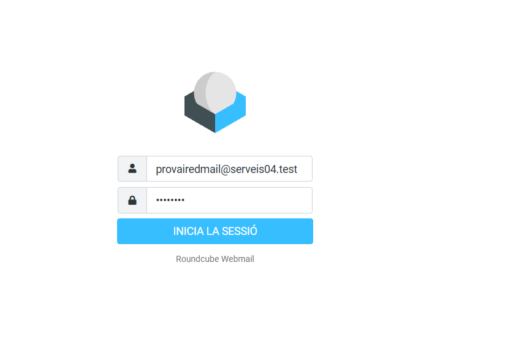

**Què s'hi veu?**  
La pantalla de login de Roundcube amb l'usuari `provairedmail@serveis04.test`.

**Què s'està fent?**  
L'usuari destinatari inicia sessió per comprovar si ha rebut el correu.

---

## 📸 Captura 28 – Recepció del correu

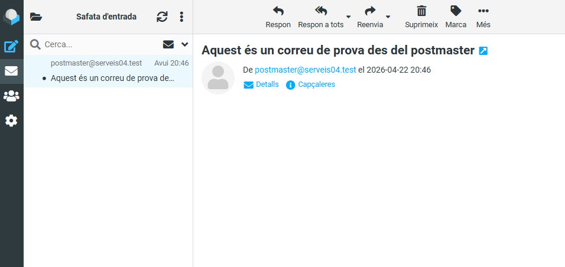

**Què s'hi veu?**  
La safata d'entrada de `provairedmail@serveis04.test` amb el correu rebut.

**Què s'està fent?**  
Es confirma que el correu de prova ha arribat correctament.

---

## 📸 Captura 29 – Resposta al correu

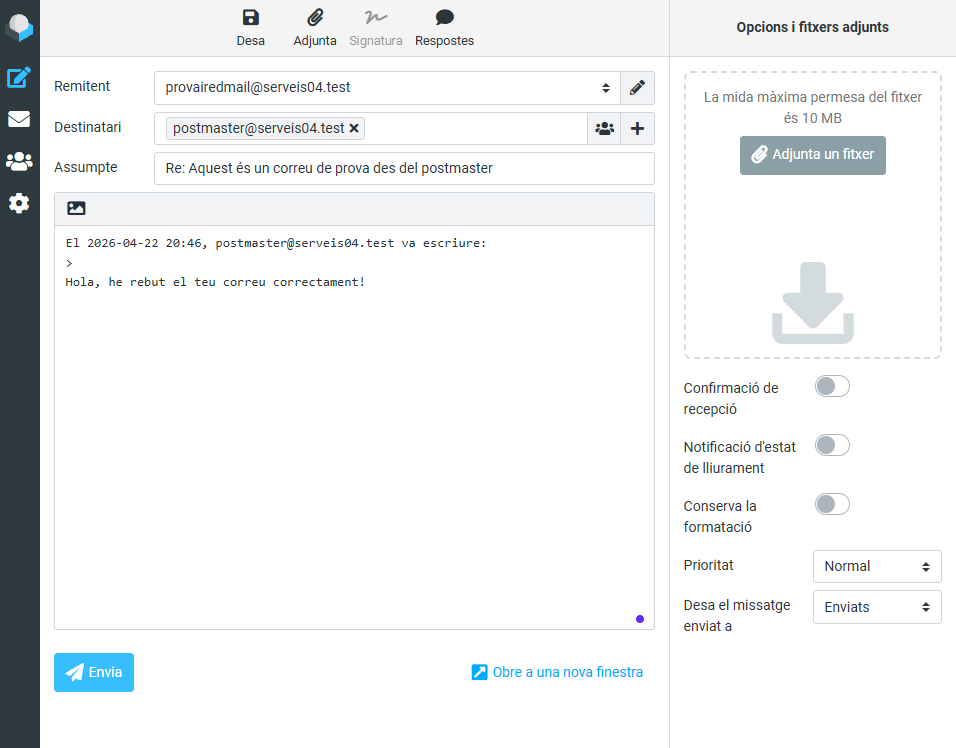

**Què s'hi veu?**  
El formulari de resposta des de `provairedmail@serveis04.test` a `postmaster@serveis04.test`.

**Què s'està fent?**  
L'usuari destinatari respon al correu per verificar la comunicació bidireccional.

---

## 📸 Captura 30 – Confirmació de la resposta

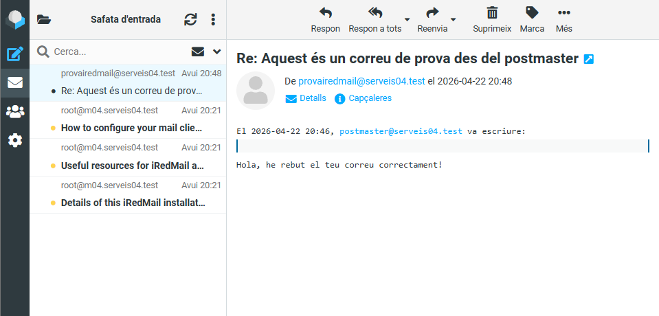

**Què s'hi veu?**  
La safata d'entrada del `postmaster` amb la resposta rebuda.

**Què s'està fent?**  
Es verifica que la resposta ha arribat correctament al remitent original.

---

## 📸 Captura 31 – Creació d'un usuari temporal

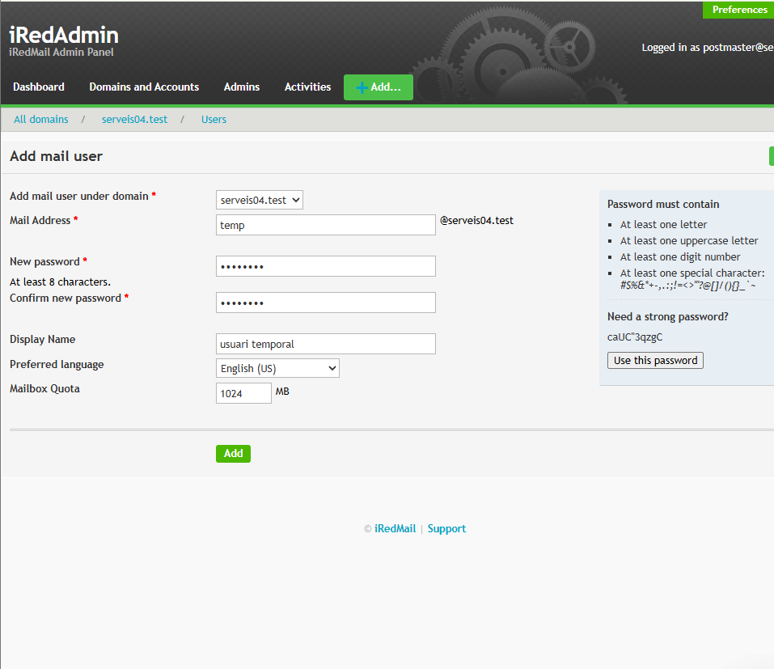

**Què s'hi veu?**  
El formulari per crear l'usuari `temp@serveis04.test` amb quota de 1024 MB.

**Què s'està fent?**  
Es crea un usuari temporal per provar l'eliminació posterior.

---

## 📸 Captura 32 – Llista d'usuaris del domini

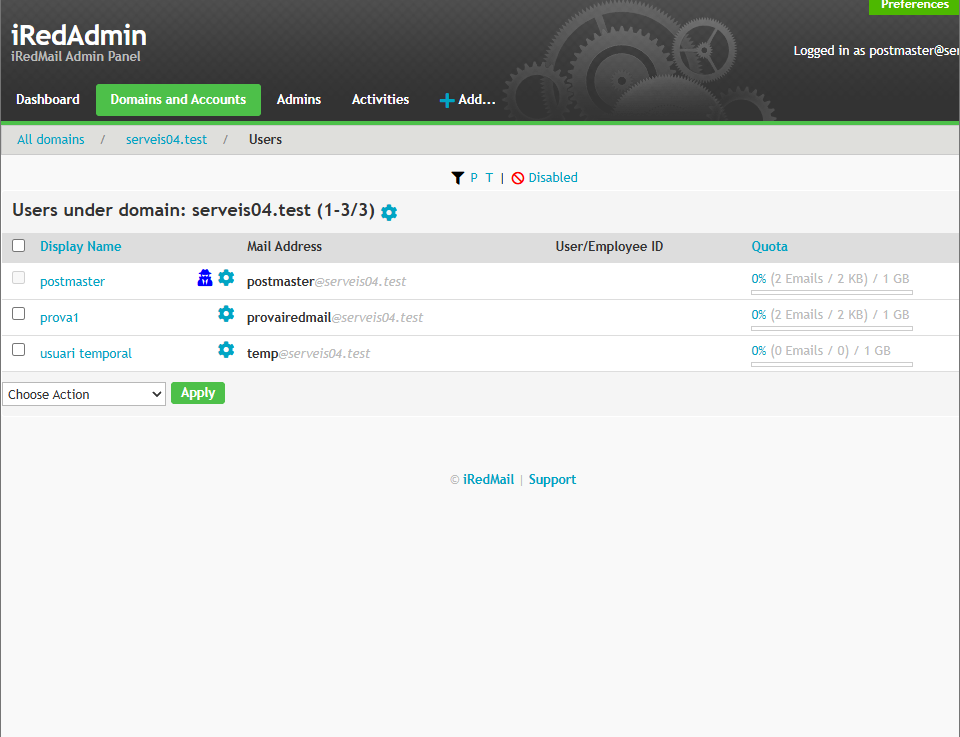

**Què s'hi veu?**  
Els tres usuaris del domini `serveis04.test`: `postmaster`, `provairedmail` i `temp`.

**Què s'està fent?**  
Es visualitzen tots els usuaris creats al domini principal.

---

## 📸 Captura 33 – Eliminació d'un usuari

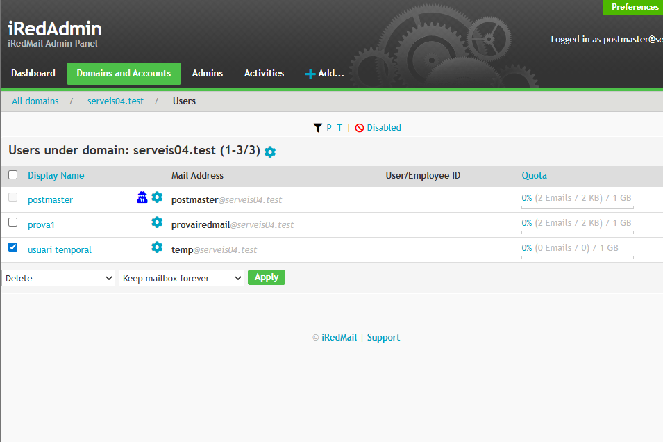

**Què s'hi veu?**  
El botó `Delete` seleccionat per eliminar l'usuari `temp@serveis04.test`.

**Què s'està fent?**  
S'elimina l'usuari temporal del sistema.

---

## 📸 Captura 34 – Registre d'activitats de l'administrador

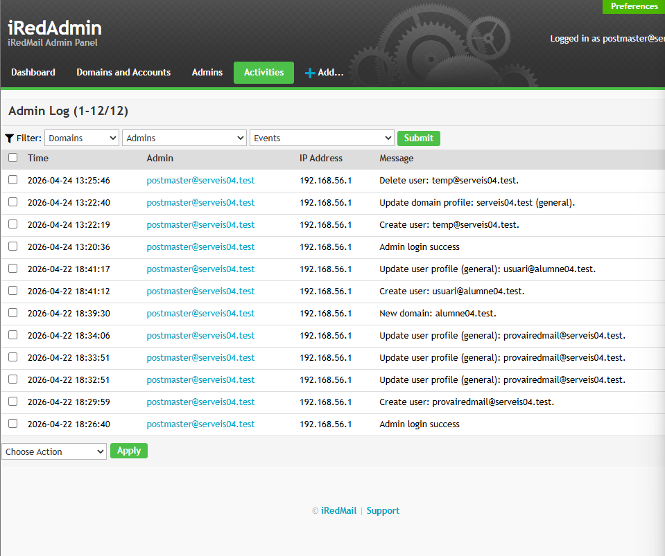

**Què s'hi veu?**  
El log d'activitats on consta: `Delete user: temp@serveis04.test`.

**Què s'està fent?**  
Es verifica que l'eliminació de l'usuari ha quedat registrada al sistema.

---

## 📸 Captura 35 – Safata d'entrada del webmail

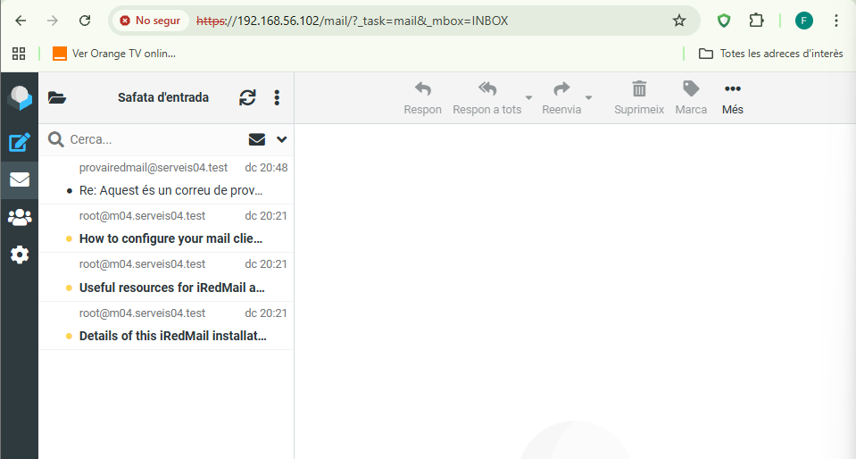

**Què s'hi veu?**  
La safata d'entrada amb diversos correus rebuts i la carpeta de correu brossa.

**Què s'està fent?**  
Es navega per les diferents carpetes del webmail.

---

## 📸 Captura 36 – Creació de l'usuari user1

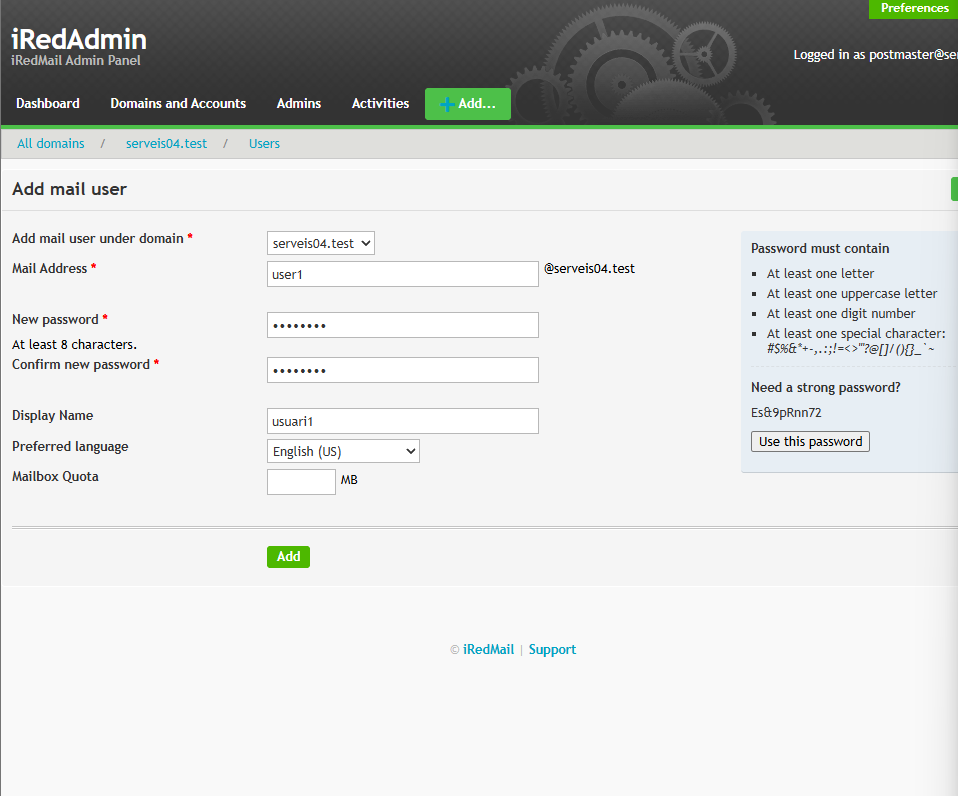

**Què s'hi veu?**  
El formulari per crear l'usuari `user1@serveis04.test` amb contrasenya `Esä9pRnn72`.

**Què s'està fent?**  
Es crea el primer usuari per a les proves de correu intern.

---

## 📸 Captura 37 – Creació de l'usuari user2

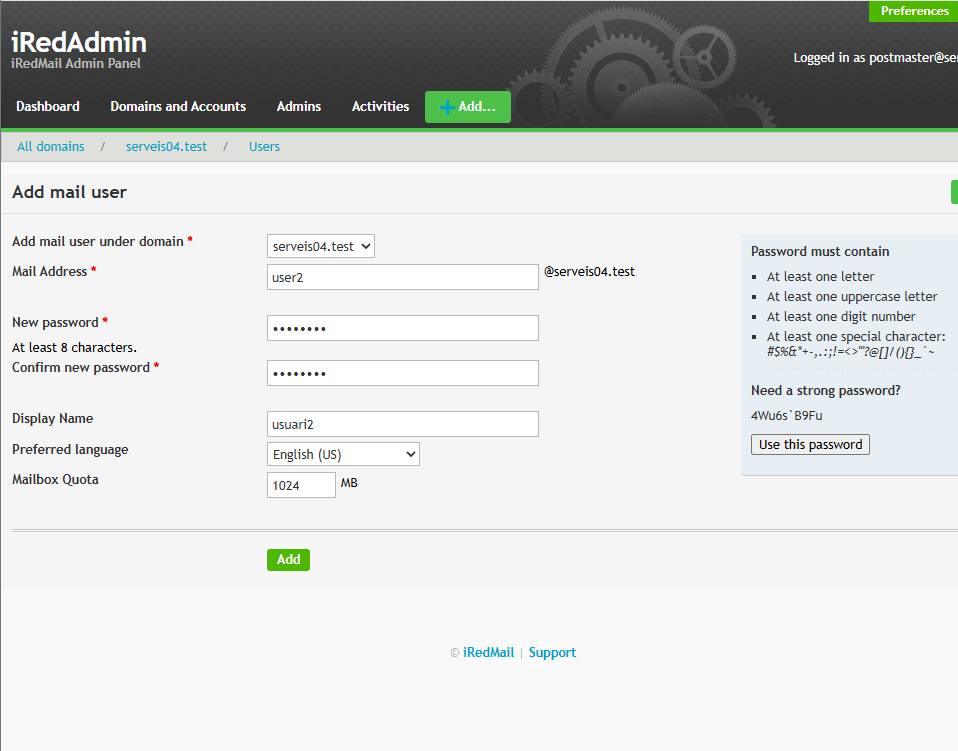

**Què s'hi veu?**  
El formulari per crear l'usuari `user2@serveis04.test` amb contrasenya `4Wu6s\`B9Fu`.

**Què s'està fent?**  
Es crea el segon usuari per a les proves de correu intern.

---

## 📸 Captura 38 – Enviament de correu intern

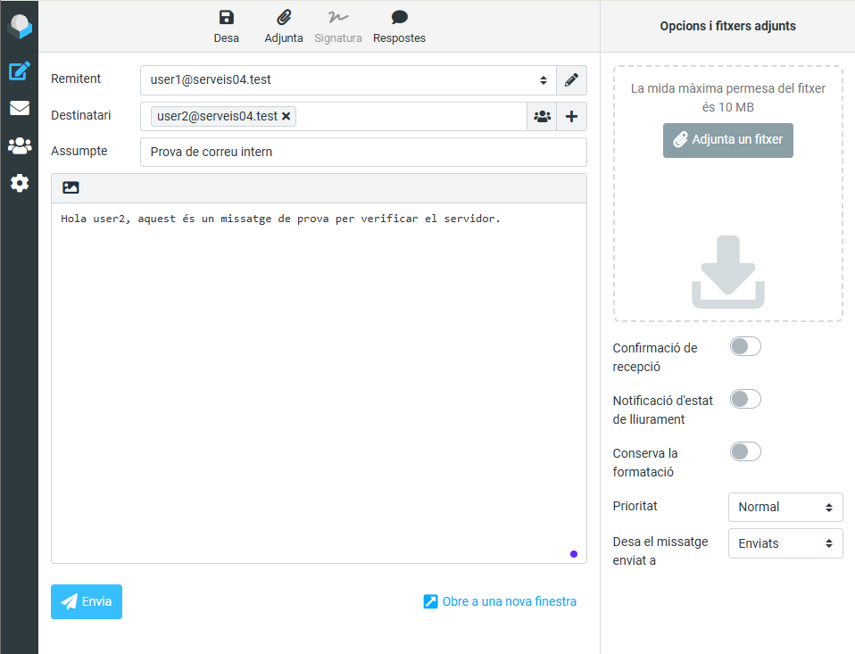

**Què s'hi veu?**  
El formulari de redacció des de `user1@serveis04.test` a `user2@serveis04.test`.

**Què s'està fent?**  
S'envia un correu de prova entre dos usuaris del mateix domini.

---

## 📸 Captura 39 – Recepció del correu intern

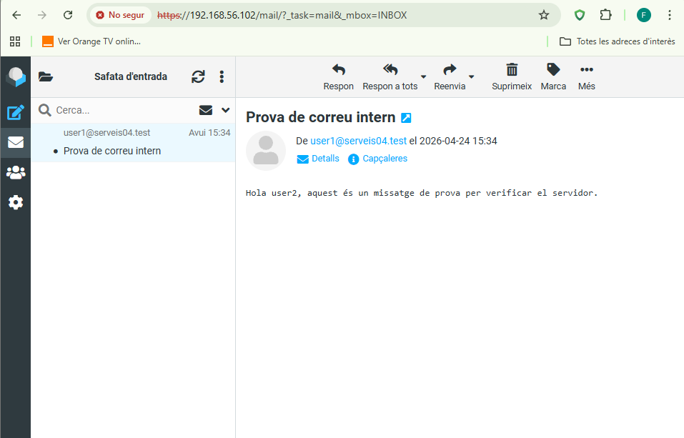

**Què s'hi veu?**  
La safata d'entrada de `user2@serveis04.test` amb el correu rebut.

**Què s'està fent?**  
Es confirma que la comunicació entre usuaris del mateix domini funciona correctament.

---

## 📸 Captura 40 – Enviament de correu extern

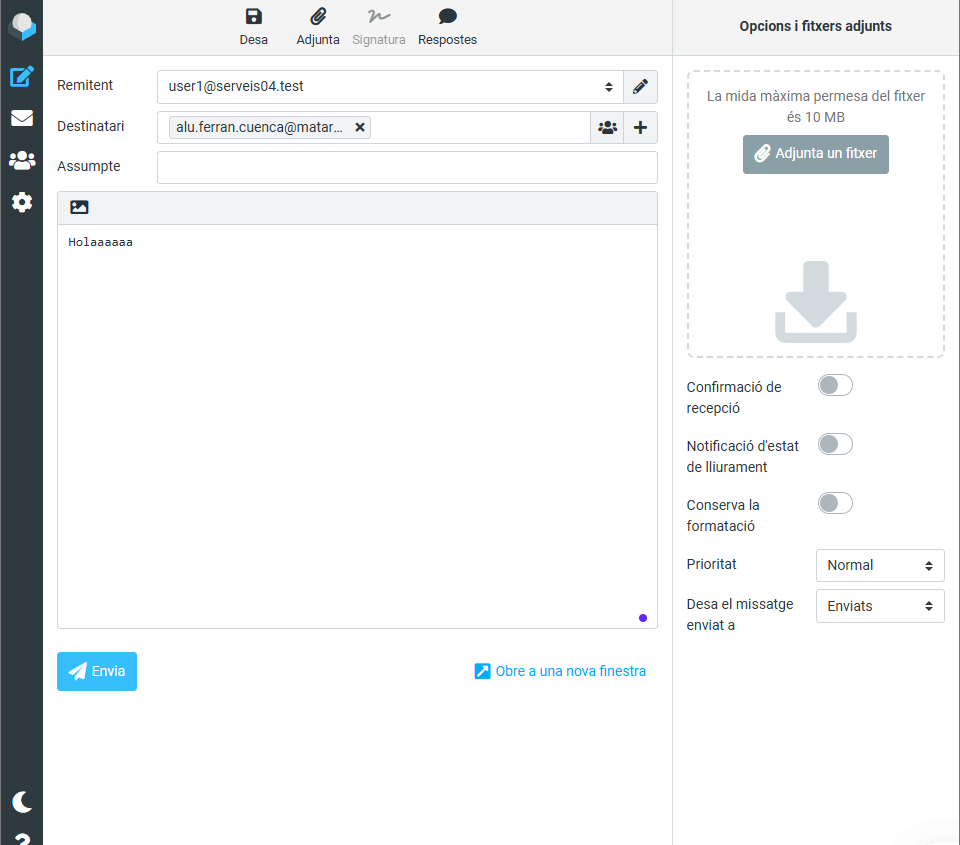

**Què s'hi veu?**  
El formulari de redacció des de `user1@serveis04.test` cap a un compte de Gmail.

**Què s'està fent?**  
S'envia un correu a un servei extern (Gmail) per provar la comunicació cap a l'exterior.

---

## 📸 Captura 41 – Correu extern rebut a Gmail

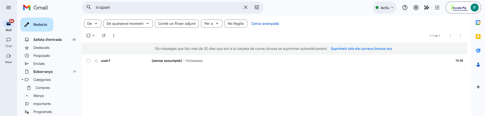

**Què s'hi veu?**  
La safata d'entrada de Gmail amb el correu rebut a la carpeta de correu brossa (spam).

**Què s'està fent?**  
Es verifica que el correu extern arriba, però com que no hi ha registres SPF/DKIM, es marca com a spam.

---

## 📸 Captura 42 – Detall del correu marcat com a spam

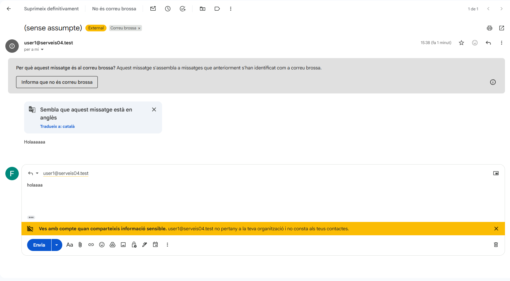

**Què s'hi veu?**  
El missatge d'advertència de Gmail: "Per què aquest missatge és al correu brossa?".

**Què s'està fent?**  
S'analitza per què el correu ha anat a spam (manca de configuració DNS de seguretat).

---

## 📸 Captura 43 – Opcions del webmail

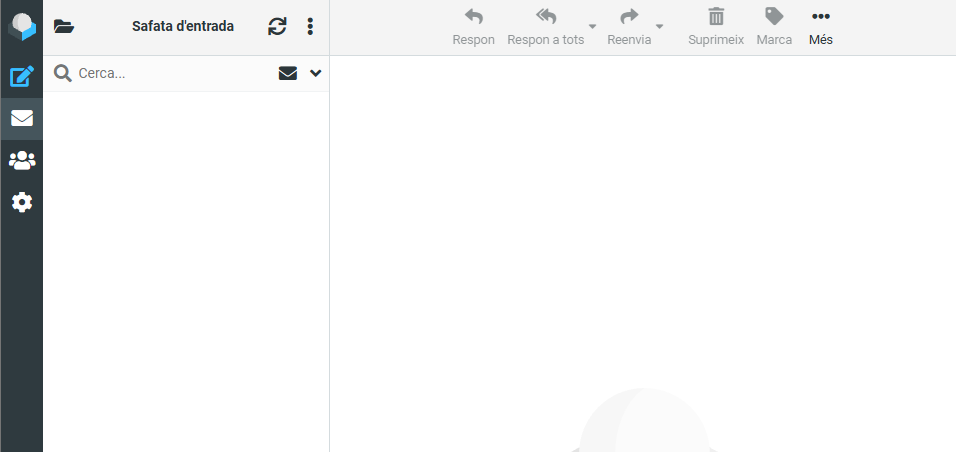

**Què s'hi veu?**  
La barra d'eines del webmail amb opcions: Respon, Respon a tots, Reenvia, Suprimeix, Marca, Més.

**Què s'està fent?**  
Es mostren les accions que es poden realitzar sobre un correu rebut.

---

## ✅ Resum final de la pràctica

| Element | Detall |
|---------|--------|
| **Servidor** | Ubuntu amb iRedMail 1.8.0 |
| **Hostname** | `m04.serveis04.test` |
| **IP d'accés** | `192.168.56.102` |
| **Domini principal** | `serveis04.test` |
| **Domini secundari** | `alumne04.test` |
| **Usuaris creats** | `postmaster`, `provairedmail`, `temp` (eliminat), `user1`, `user2`, `usuari` |
| **Webmail** | Roundcube a `/mail` |
| **Panell d'admin** | iRedAdmin a `/iredadmin` |
| **Monitorització** | Netdata a `/netdata` |
| **Serveis instal·lats** | Postfix, Dovecot, MariaDB, Nginx, Fail2ban |
| **Proves internes** | ✅ Correus entre usuaris del mateix domini |
| **Proves externes** | ✅ Correus enviats a Gmail (marquen com a spam) |
| **Emmagatzematge** | `/var/vmail` |
| **Base de dades** | MariaDB |

---